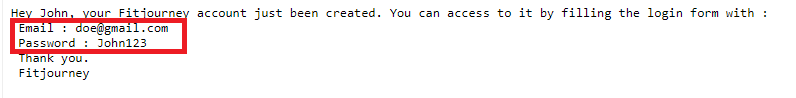
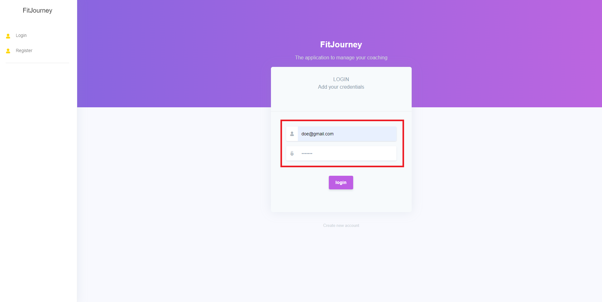
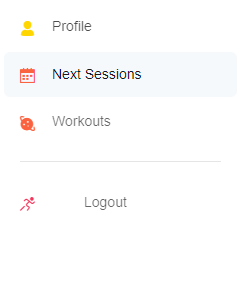
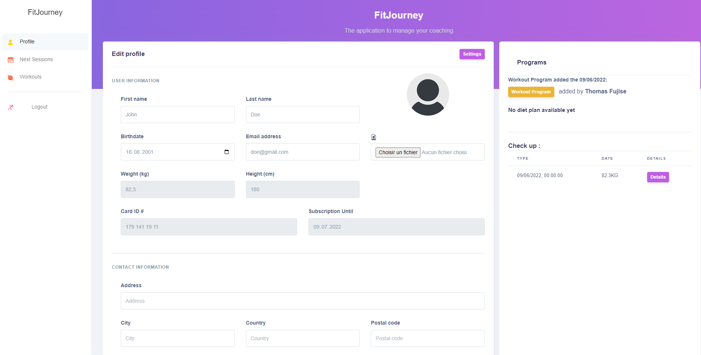
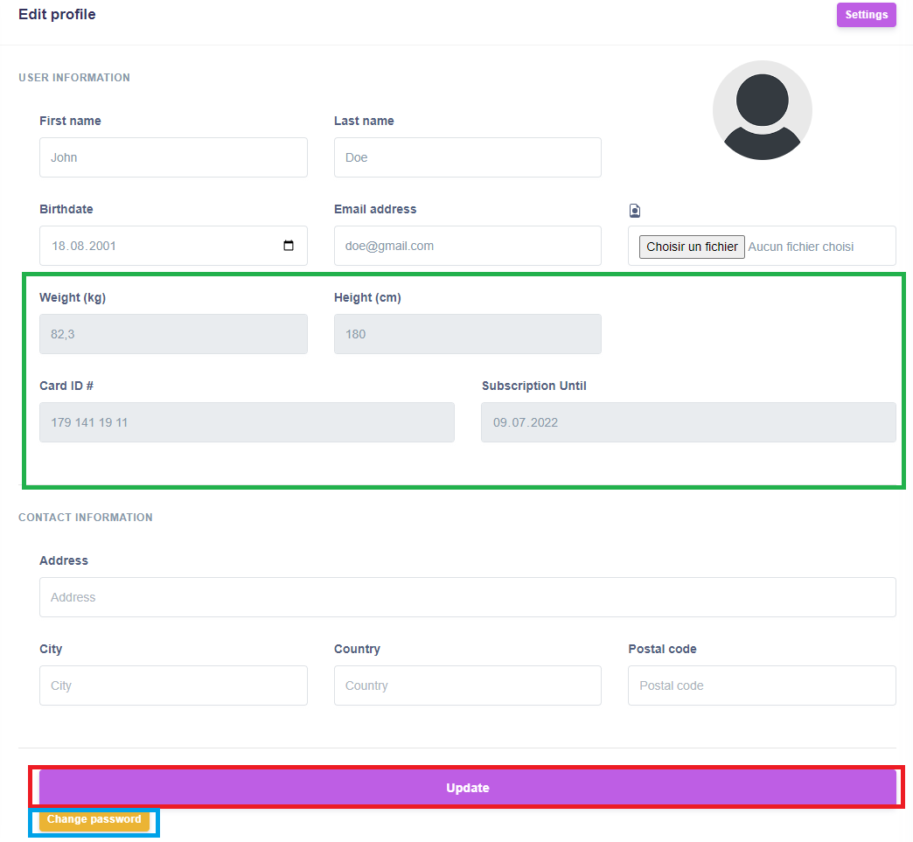
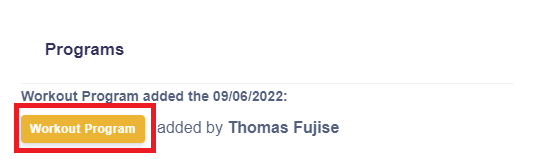
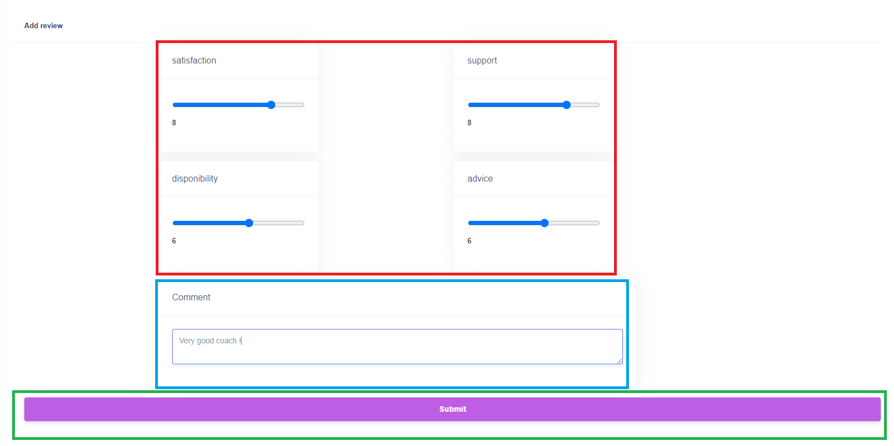
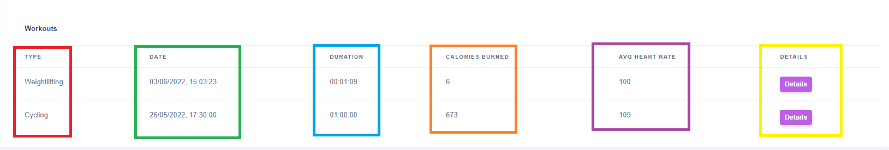
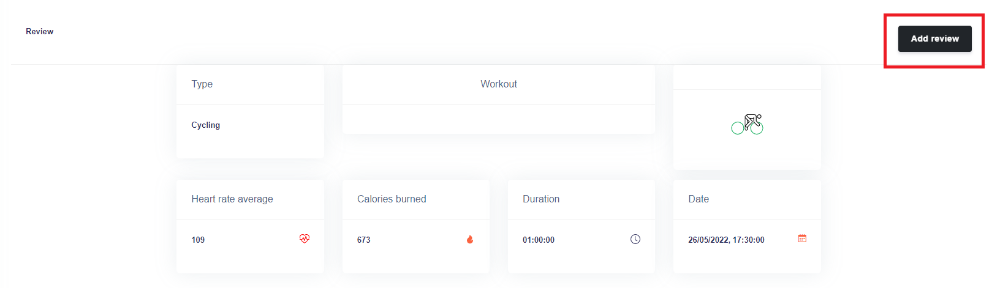

# Client guide
Ce document représente le manuel utilisateur de l'application pour client.

## Connexion
La page de connexion est la première page de l'application. Pour se connecter, il suffit de remplir le formulaire de connexion avec les identifiants que vous avez reçu par mail lors de votre inscription.

Exemple de mail reçu avec en **rouge** les identifiants pour se connecter :

## Navigation
Une fois connecté, une barre de navigation est disponible :

* **Profile** : Permet d'aller sur la [page de profil](#profil)
* **Next Sessions** : Permet d'aller sur la page affichant les [prochaines sessions](#prochaines-sessions)
* **Workouts** : Permet d'aller sur la page affichant les [entrainements](#entrainements)
* **Logout** : Permet de se déconnecter

## Profil
La page profil affiche beaucoup d'informations, on y retrouve vos données personnelles, les programmes ajoutés par le coach, la liste des bilans, la liste des reviews ajoutées ainsi que des graphiques illustrant les données d'entrainements en bas de page.

Les données d'entrainements sont affichées sur des graphiques. Si vous n'avez pas encore effectué d'entrainements, les graphiques ne comporteront aucune valeur. 

Au fur et à mesure des entrainements les graphiques se rempliront : 

* **Rouge** : Graphique illustrant le nombre de chaque type d'entrainement effectués
* **Bleu** : Graphique illustrant le nombre d'entrainement effectué par mois
* **Vert** : Statistiques donnant :
    * Le total de calories brulées cette semaine
    * La moyenne de BPM cardiaque cette semaine
    * Le total de temps passé à s'entrainer cette semaine (en minute)
* **Orange** : Graphique illustrant l'évolution du poids sur l'année

### Modification de compte
Vous avez la possibilitée de modifier certaines informations de votre compte avec le formulaire présent sur la page de profil.

On retrouve en :

* **Vert** : Les champs que vous ne pouvez pas modifier vous-même
* **Rouge** : Le bouton pour valider les modifications
* **Bleu** : Le bouton pour [changer de mot de passe](#changement-de-mot-de-passe)

Si une modification est effectuée, un message de confirmation s'affiche en haut : 

### Changement de mot de passe
Pour changer de mot de passe, il faut renseigner l'ancien mot de passe ainsi que le nouveau mot de passe souhaité avec confirmation.

En **rouge**, le bouton pour valider le changement. Si le changement est effectué, un message de confirmation s'affiche en haut : 

### Téléchargement de programme
Pour télécharger un programme il suffit de cliquer sur le bouton du programme souhaité.

Exemple avec un programme d'entrainement ci-dessous (en rouge):

Une fois le bouton cliqué, il faut choisir la destination du fichier puis le téléchargement du fichier pdf est lancé.
### Ajout de review coaching
Pour ajouter une review sur le coaching de manière générale, il suffit de cliquer sur le bouton "Add new review" dans la section "Reports" de la page profil :

Une fois le bouton cliqué, vous êtes redirigé vers le formulaire d'ajout :

On retrouve en :
* **Rouge** : Les champs à renseigner pour la review
* **Bleu** : Un champ pour ajouter un commentaire
* **Vert** : Le bouton pour valider l'ajout de la review

Une fois la review ajoutée, un message de confirmation s'affiche :

et la review est visible dans la section "Reports" avec en **rouge** un bouton "Details" qui permet d'afficher les détails de votre review.

## Prochaines sessions
La page de prochaines sessions affiche simplement les sessions que vous avez planifié avec votre coach. 

On retrouve dans la colonne en :
* **Rouge** : Le logo du type d'entrainement prévu
* **Bleu** : Le nom du type d'entrainement prévu
* **Orange** : La date de la session
* **Vert** : La durée de la session
* **Jaune** : L'heure de la session

## Entrainements
La page d'entrainements affiche simplement tous les entrainements que vous avez effectué.

On retrouve calonne en :
* **Rouge** : Le type d'entrainement effectué;
* **Vert** : La date et heure de l'entrainement;
* **Bleu** : La durée de l'entrainement;
* **Orange** : Le nombre de calories brulées;
* **Violet** : La moyenne de BPM cardiaque durant la séance;
* **Jaune** : Le bouton permettant d'affiche les [détails de l'entrainement](#détails-dentrainement);

### Détails d'entrainement
La page de détails affiche les détails d'un entrainement que vous avez effectué, avec le bouton "Add review" en **rouge** vous pouvez laisser un retour sur cet entrainement.

#### Ajout de review entrainement
Pour ajouter une review sur un entraînement que vous avez effectué, il suffit de cliquer sur le bouton "Add review" disponible sur la page de [détails de l'entrainement](#détails-dentrainement).

Une fois cliqué, vous êtes redirigé vers le formulaire d'ajout :

On retrouve en :
* **Rouge** : Les champs à renseigner pour la review
* **Bleu** : Un champ pour ajouter un commentaire
* **Vert** : Le bouton pour valider l'ajout de la review

Une fois la review ajoutée, un message de confirmation s'affiche :

et comme pour les [review coaching](#ajout-de-review-coaching) la review est visible dans la section "Reports" avec en **rouge** un bouton "Details" qui permet d'afficher les détails de votre review.

