# Coach Guide
Ce document représente le manuel utilisateur de l'application pour coach.

## Inscription
La page d'inscription est la première page de l'application, c'est ici que l'on peut créer un nouveau compte coach.

Il suffit de remplir le formulaire d'inscription en **rouge**. L'email utilisé ne doit pas avoir été utilisé pour un autre compte et les mots de passe doivent correspondre.

Si l'inscription a été validé un message de confirmation s'affichera et vous serez redirigé sur la page de [connexion](#connexion).

## Connexion
Une fois un compte créé, vous pouvez vous connecter directement avec ce formulaire de connexion. Il vous suffit de saisir l'email ainsi que votre mot de passe.

## Navigation
Une fois connecté, une barre de navigation est disponible :

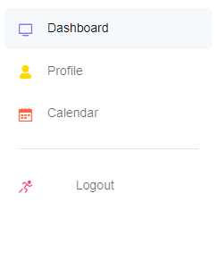

* **Dashboard** : Permet d'aller sur la page [tableau de bord](#tableau-de-bord)
* **Profile** : Permet d'aller sur la page [profil](#profil)
* **Calendar** : Permet d'aller sur la page [calendrier](#calendrier)

* **Logout** : Permet de se déconnecter

## Tableau de bord
Le tableau de bord n'est pas très remplis de base car aucun client n'est encore assigné. 

Vous pouvez retrouvez en :
* **Bleu** : L'emplacement ou se trouve la prochaine session enregistrée
* **Rouge** : Le bouton permettant d'[ajouter un client](#ajout-client) 

### Ajout client
Pour ajouter un client, il suffit de renseigner le formulaire d'ajout avec les champs suivants : 

* **Nom** 
* **Prénom**
* **Email** 
* **Date de naissance**
* **Taille**
* **Date de commencement**
* **Type d'abonnement**

Une fois le client ajouté, un message de confirmation s'affichera (le client va recevoir un mail de confirmation avec ses identifiants):

et le client s'affichera dans la liste des clients à charge : 

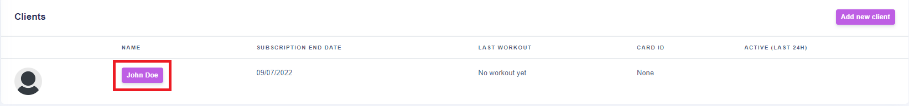

Le nom des clients est affiché sur un bouton qui redirige vers leurs [profils](#profil-client)

### Profil client 
La page de profil des clients affiche beaucoup d'informations. On peut y retrouver beaucoup d'informations. Au début la page semblera vide, cela est du au fait que le client vient d'être créé et ne possède pas énormement de données.

Les données d'entrainements sont affichées sur des graphiques. Si le client n'a pas encore effectué d'entrainements, les graphiques ne comporteront aucune valeur. 

Au fur et à mesure des entrainements les graphiques se rempliront : 

* **Rouge** : Graphique illustrant le nombre de chaque type d'entrainement effectués
* **Bleu** : Graphique illustrant le nombre d'entrainement effectué par mois
* **Vert** : Statistiques donnant :
    * Le total de calories brulées cette semaine
    * La moyenne de BPM cardiaque cette semaine
    * Le total de temps passé à s'entrainer cette semaine (en minute)
* **Orange** : Graphique illustrant l'évolution du poids sur l'année

Quelques actions sont disponibles sur la page profil du client 

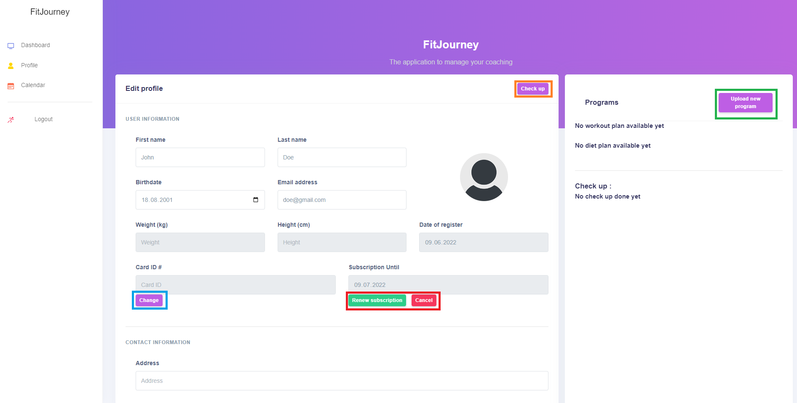

On retrouve en : 
* **Bleu** : le bouton permettant de modifier la [carte de membre](#changement-de-carte-membre) du client
* **Rouge** : Les boutons pour [renouveller](#renouvellement-abonnement) et [annuler](#annulation-abonnement) l'abonnement du client
* **Vert** : Le bouton pour ajouter un [nouveau programme](#ajout-programme) pour le client 
* **Orange** : Le bouton pour ajouter un nouveau [bilan](#ajout-bilan)

#### Changement de carte membre
En cliquant sur le bouton "Change", vous avez 30 secondes pour scanner une nouvelle carte avec le lecteur RFID

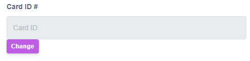

Lecteur RFID : 
{width: 200px}

Carte de membre : 
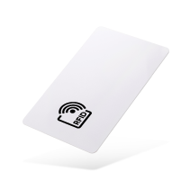

Une fois la carte scannée, une message de confirmation s'affichera en haut :
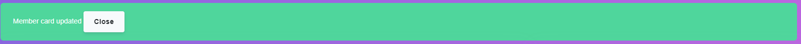

et le numéro de la nouvelle carte sera renseigné automatiquement dans le champ :

#### Renouvellement abonnement
Pour renouveller l'abonnment du client, il y a uniquement 2 champs à renseigner :
* La date de début du nouvel abonnement
* Le type d'abonnement souhaité

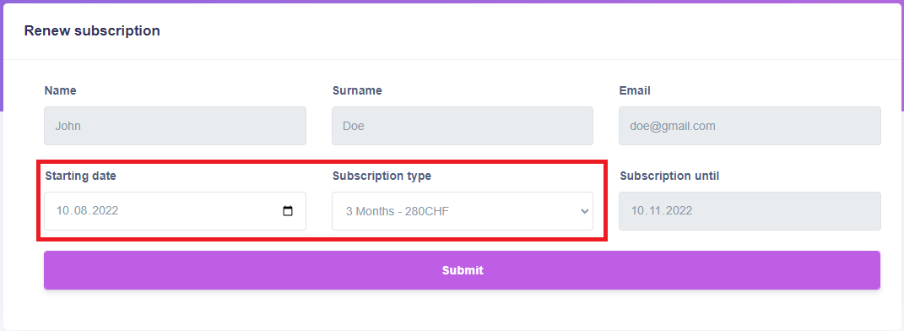

Une fois le renouvellement effectué, un message de confirmation est affiché (le client va recevoir également un mail de confirmation):

et la date de fin d'abonnement affiché sur le profil du client a été automatiquement mis à jour 

#### Annulation abonnement
Pour annuler l'abonnement d'un client, il suffit d'appuyer sur le bouton "Cancel". Un message de confirmation s'affichera si l'annulation a bien été effectué :

La date de fin d'abonnement du client affichée redeviendra celle du plus vieil abonnement souscrit.

#### Ajout programme
Pour ajouter un programme il suffit de remplir le formulaire d'ajout qui demande uniquement le *type* de programme ainsi que le fichier *PDF*.

Les 2 types disponibles sont :
* Entrainement
* Nutrition

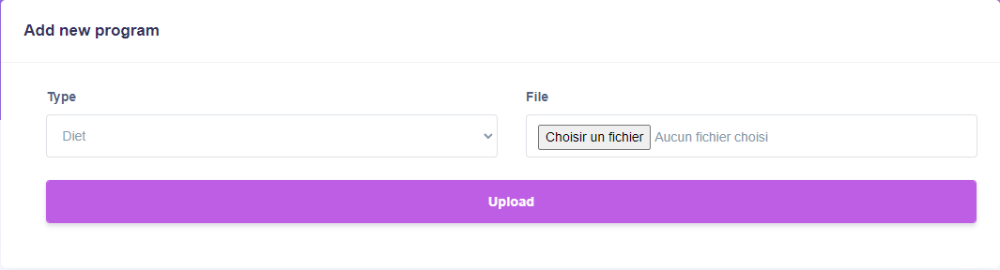

Une fois ajouté, un message de confirmation s'affiche :

et le programme du type ajouté est disponible dans la section "Programs"

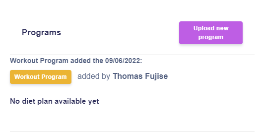

(C'est toujours le programme le plus récent par type qui est affiché)
#### Ajout bilan 
Pour l'ajout de bilan, vous devez vous munir de votre balance connecté permettant de récolter toutes les données nécessaire pour remplir le formulaire d'ajout de bilan. Seul les champs encadré en rouge sont a remplir, les autres champs sont renseignés automatiquement

Une fois le bilan ajouté, un message de confirmation s'affiche en haut :

Il sera également disponible dans la section "Check up". Le bouton "Details" afficher à côté de chaque bilan permet d'afficher les détails de ce dernier.

## Profil
La page profil du coach permet de modifier les informations du compte. 

On retrouve en :
* **Rouge** : Le bouton pour valider les changements
* **Bleu** : Le bouton pour [changer de mot de passe](#changement-de-mot-de-passe)

Si une modification est effectuée, un message de confirmation s'affiche : 

### Changement de mot de passe
Pour changer de mot de passe, il faut renseigner l'ancien mot de passe ainsi que le nouveau mot de passe souhaité avec confirmation.

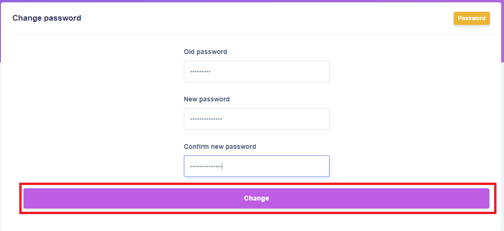

En **rouge**, le bouton pour valider le changement. Si le changement est effectué, un message de confirmation s'affiche en haut : 

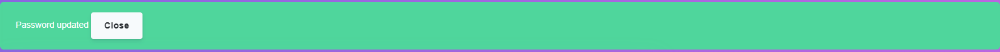

## Calendrier
La page calendrier comporte votre agenda en tant que coach ainsi qu'un formulaire d'ajout de session.

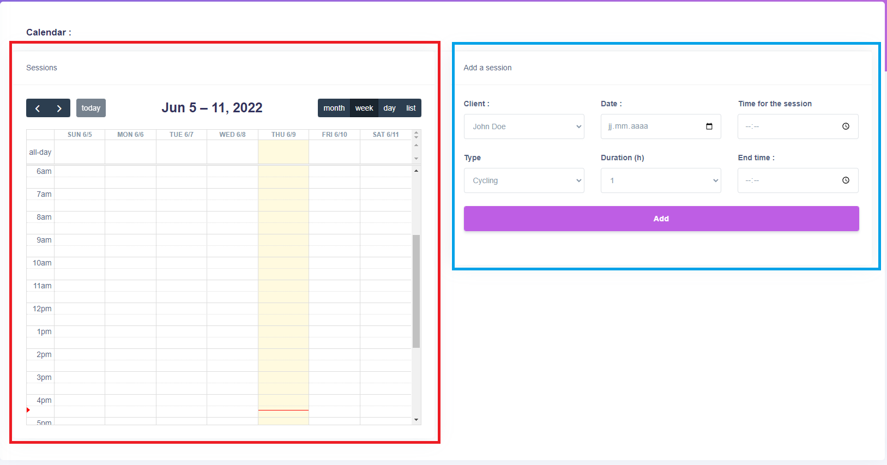

On retrouve en :
* **Rouge** : L'agenda qui affiche toutes les sessions enregistrées
* **Bleu** : Le formulaire pour [ajouter une session](#ajout-session)

### Ajout session
Pour ajouter une session, il suffit de séléctionner le client souhaité et de renseigner les champs. Une fois les champs renseigné, le bouton "Add" en **rouge** ajoutera la session a votre agenda.

