# Documentation technique 

## Résumé 
FitJourney est une application permettant, d'une part, à un coach sportif de gérer et effectuer le suivi de tous ses clients avec des données d'entrainements récupérées à l'aide de montres connectés Polar. D'autre part, elle permet aux clients d'accéder à leurs programmes d'entrainements et de nutrition. L'application permet également aux clients de visionner le détail de chacune de leurs séances.

FitJourney est une application WEB réalisée avec le framework Flask du langage Python, elle repose principalement sur l'API Polar Accesslink qui permet l'utilisation des données des montres connectées

Ce document reprend toutes les étapes du projet qui a été réalisé dans le cadre du travail de diplôme de la formation Technicien ES en informatique de Thomas Fujise.

## Abstract
FitJourney is an application that allows personal trainers to follow up all their clients training data that is retrieved using Polar connected watches. It also allows clients to access their training and diet plan. The application allows clients to look at the details of each of their workouts.

FitJourney is a WEB application made with Flask Python framework. It relies mainly on the Polar Accesslink API which allows the use of data from connected watches.

This document contains all the steps of the project, which was carried out within the diploma project of the IT Technician formation of Thomas Fujise

## Introduction
Il existe très peu d'outil qui permet à un coach sportif de gérer sa salle de sport avec le suivi de tous ses clients. C'est pourquoi, j'ai décidé de créer une application qui permettrait de gérer une salle de sports ainsi que le suivi des membres. Ayant passé un diplôme de coach sportif l'année passée, j'étais à l'aise avec les besoins qu'un professionnel aurait en cas d'utilisation de l'application.

Cette application permet de gérer la salle de sport avec les cartes de membres qui permettent l'accès à la salle ou encore les montres connectés pour enregistrés les données d'entrainements des clients. Elle permet également le suivi des clients.

## Analyse de l'existant

## Cahier des charges


## Analyse fonctionnelle

### Cas d'utilisations
2 cas d'utilisations sont possibles avec l'application.

#### Client 

Le cas d'utilisation pour client : 

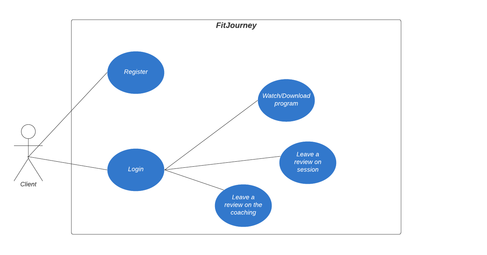

Le client n'a que 2 possibilitées sur l'application : 

* S'enregistrer

* Se connecter

Si le client se connecte à l'application, il a alors accès à plusieurs fonctionnalitées :

* Visualiser/Télécharger ses programmes (Entrainement et Nutrition)
* Laisser un retour sur une session effectué
* Laisser un retour sur le coaching de manière générale


#### Coach

Le cas d'utilisation pour coach :

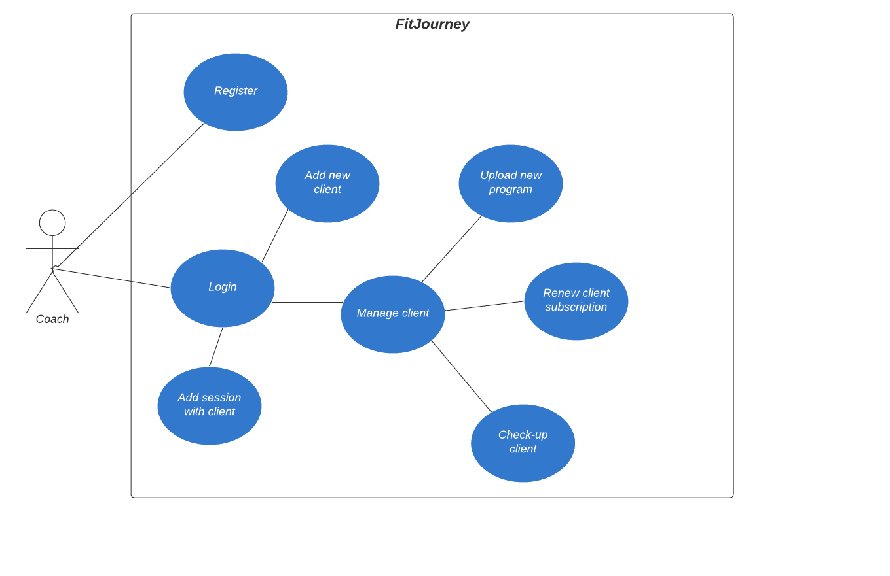

Le coach à lui également 2 possibilitées en arrivant sur l'application (Enregistrement et connexion).

Une fois connecté, le coach à accès à une multitude de fonctionnalitées :

* Ajout d'un nouveau client
* Ajouter une session avec un client (Prise de rendez-vous)

Il a également accès à des fonctionnalitées pour gérer ses clients : 

* Importation des programmes (entrainement et nutrition)
* Renouveller l'abonnement souscrit par le client
* Effectuer un bilan avec un client 

### Sitemap
La sitemap de l'application possède 2 alternatives, 1 pour les clients et 1 pour les coachs.

#### Sitemap Client 

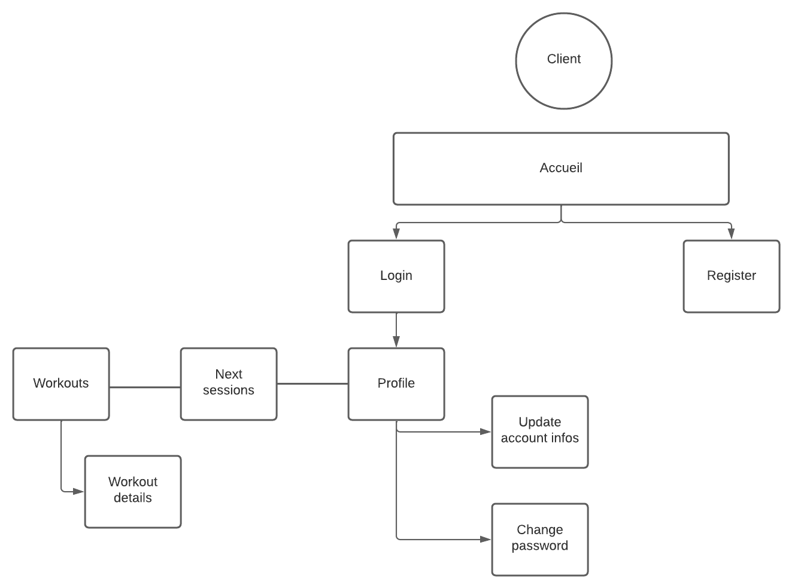 

#### Sitemap Coach

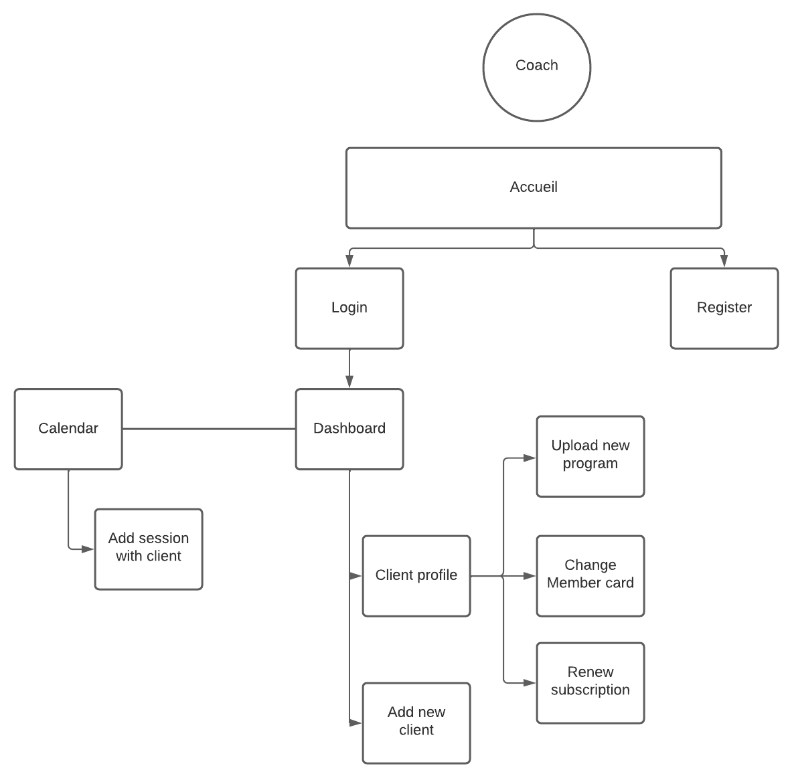 

### Maquettage
Pour préparer les interfaces, j'ai réalisé des maquettes avec l'outil Figma. Les maquettes m'ont permis de mettre à plat les éléments nécessaires pour les interfaces et ont évité de perdre trop de temps lors de la création des interfaces.

L'application FitJourney propose 3 niveaux d'accès :

* Visiteur
* Client
* Coach

#### En tant que visiteur 
Lorsqu'on arrive sur l'application sans être authentifié, seuls 3 pages sont accessibles. 

##### Barre de navigation

La barre de navigation disponible en tant que visiteur. Elle est visible sur le côté gauche de l'écran à la vertical. Sans être connecté à l'application seul 2 boutons sont disponibles :

* Accueil
* Login


##### Page d'accueil

La page d'accueil est très basique et propose 2 boutons :

* 1 bouton de connexion
* 1 bouton pour s'enregistrer

##### Page d'enregistrement
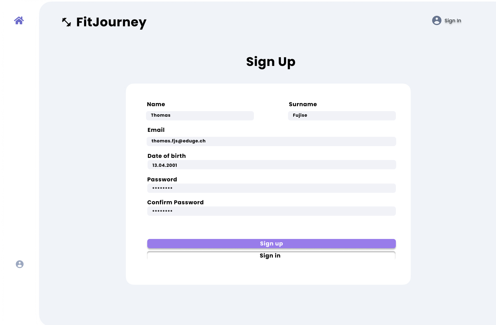
La page d'enregistrement permet aux utilisateurs de s'enregistrer, une option est disponible pour permettre la création d'un nouveau compte coach. 

##### Page de connexion 
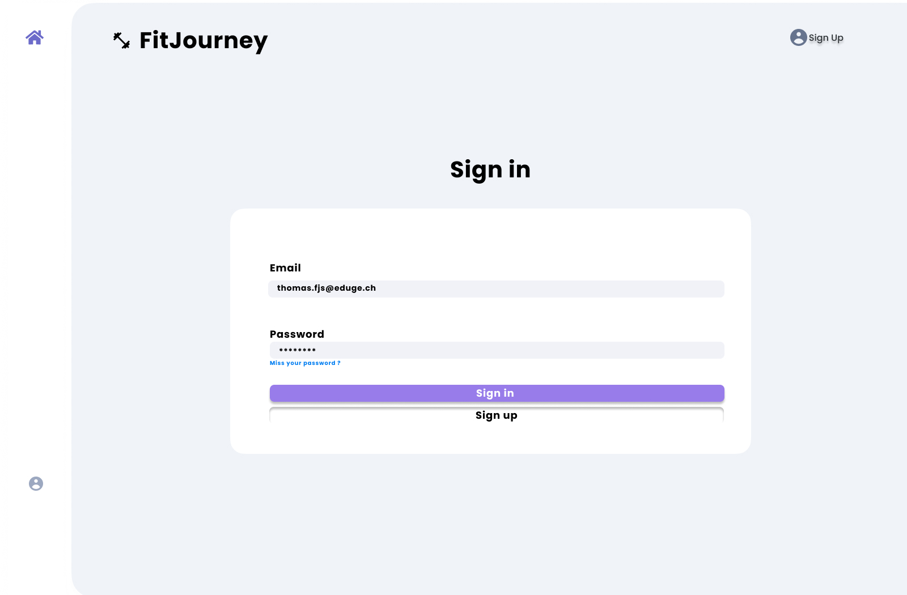
La page de connexion permet aux utilisateurs de se connecter. Un lien est disponible si le mot de passe a été oublié.


#### En tant que client 
Si on se connecte à l'application en tant que client, 4 pages supplémentaires sont disponibles.

##### Barre de navigation 


La barre de navigation disponible en tant que client verticalement à gauche de l'écran. 3 boutons de navigation supplémentaires sont disponibles :

* [Profil](#page-profil)
* [Agenda](#page-prochaine-session)
* [Entrainement](#page-liste-entrainements)

##### Page profil
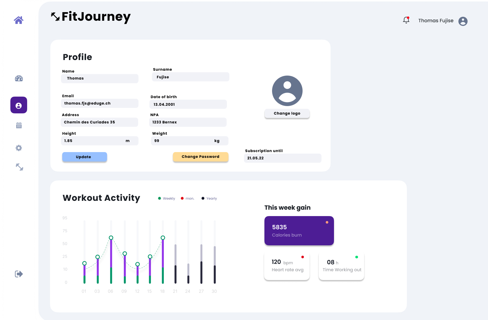

La page profil permet au client de modifier ses informations personnelles. Plusieurs boutons sont disponibles : 

* 1 bouton "Update" pour appliquer les modifications effectuées sur les informations du compte
* 1 bouton pour modifier le mot de passe 
* 1 bouton pour importer une photo de profil.

 Il a également accès à des statistiques sur les données des entrainements qu'il a effectués cette semaine (en rouge) et la liste des bilans généraux et de session que l'utilisateur a posté (en vert). Il a la possibilité d'ajouter un nouveau bilan général en cliquant sur le bouton au-dessus.


##### Page Ajout Bilan 
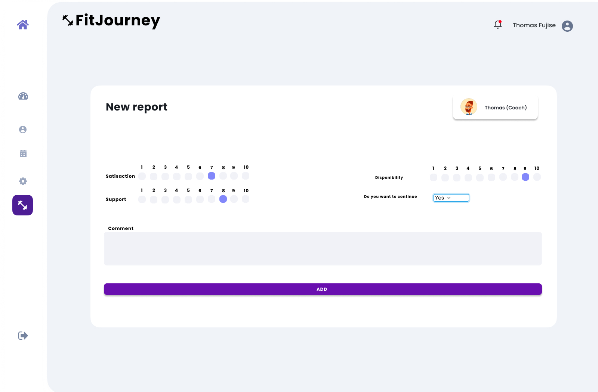

La page "Ajout Bilan" permet au client de noter, soit la qualité du suivi effectué par le coach, soit une session effectuée. 

Dans la zone rouge, l'élément qui est évalué (un coach ou une session).

Dans la zone bleue, les différents éléments à noter ainsi qu'une zone pour ajouter un commentaire.

##### Page Bilan
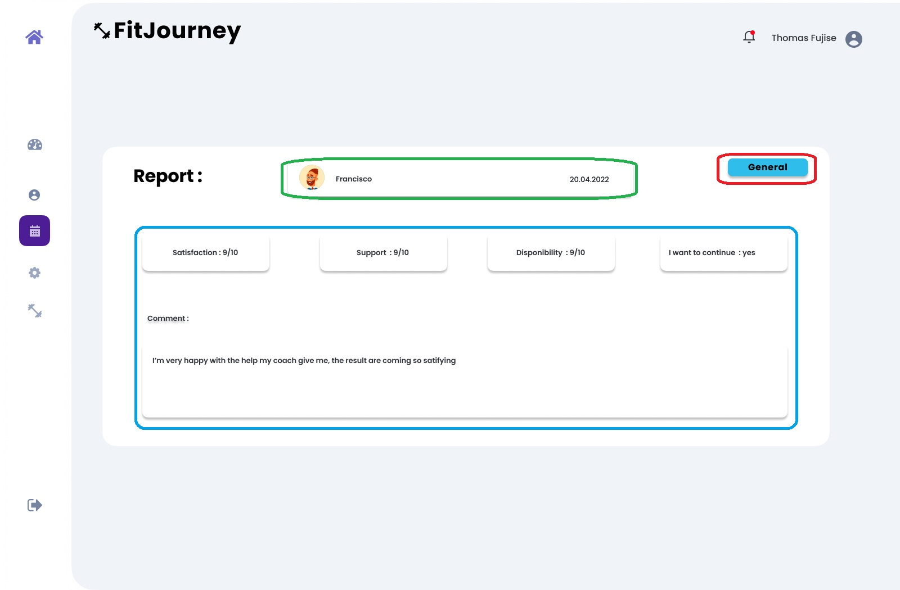

La page "Bilan" permet de voir le bilan ajouté, soit un bilan sur le suivi de manière générale, soit un bilan sur une session effectuée.

Dans la zone rouge, on peut voir de quel type de bilan il s'agit (Bilan général sur le coaching ou bilan d'une session). 

Dans la zone verte, on retrouve le client et la date à laquel le bilan a été posté.

Dans la zone bleue, on retrouve les éléments qui ont été noté par le client.

##### Page liste entrainements


Cette page affiche la liste de tous les entrainements effectués par le client. L'utilisateur peut cliquer sur chaque élément de la liste pour avoir les détails de l'entrainement.

##### Page détails entrainement
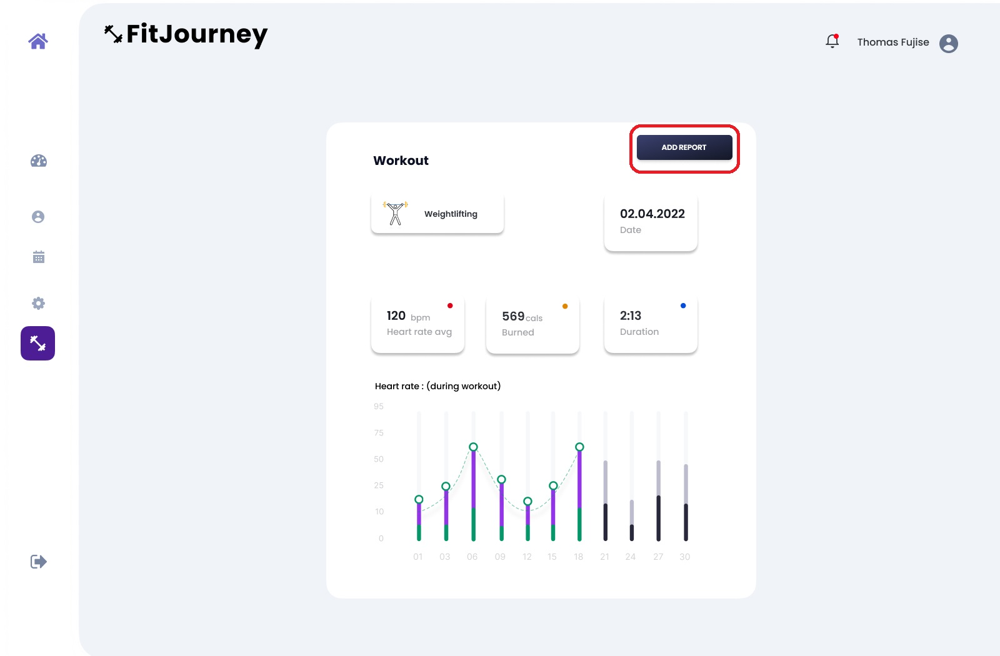

Cette page affiche les détails d'un entrainement avec les données récupérées à l'aide de la smartwatch. On peut retrouver des informations comme : 

* Le nombre de calories brûlées
* Les pulsations cardiaques par minute avec un graphique montrant l'évolution durant l'entrainement
* La durée de l'entrainement 
* Le type d'entrainement

Le client peut ajouter un bilan en cliquant sur le bouton (encadré en rouge) pour donner son ressenti sur la séance.

##### Page prochaine session
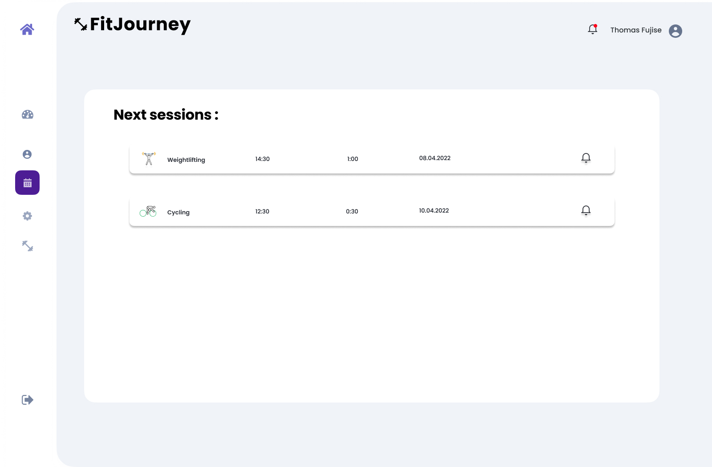

Cette page affiche les prochaines sessions d'entrainements avec un coach du client 


#### En tant que coach
Si on se connecte à l'application en tant que coach, on a alors accès à 5 autres pages.

##### Barre de navigation 


La barre de navigation disponible en tant que client verticalement à gauche de l'écran. 1 bouton supplémentaire est disponible :

* [Dashboard](#page-tableau-de-bord)

##### Page tableau de bord
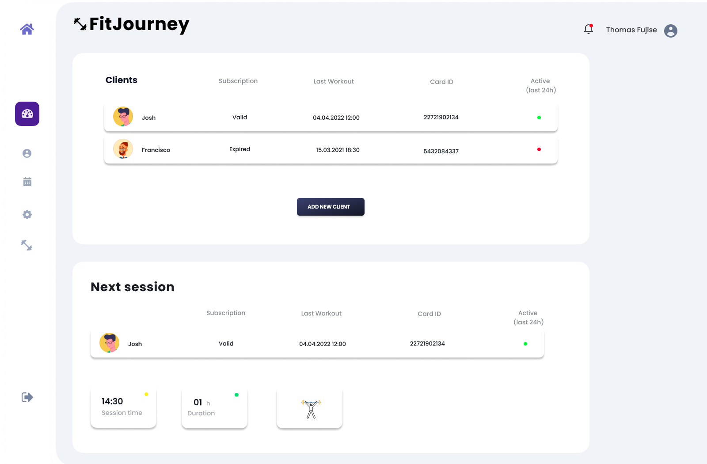

La page tableau de bord permet au coach de voir la liste des clients (en rouge) dont il effectue le suivi. Le coach peut cliquer sur le nom d'un de ses clients pour afficher le profil du client concerné. 

Il a également accès à un bouton pour ajouter un nouveau client (en bleu).
Les informations de la prochaine session avec un client sont disponibles au-dessus de la liste des clients (en vert). 

##### Page Ajout de client 
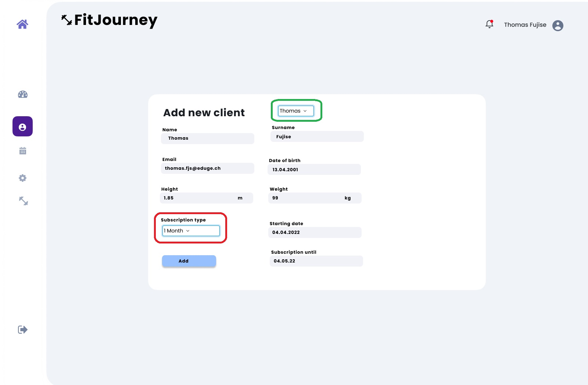

La page ajout de client permet au coach d'effectuer la prise en charge d'un nouveau client. Si le client possède déjà un compte, le coach peut séléctionner un compte déjà existant (en vert) ou créer un nouveau compte client. 

Si le coach séléctionne un compte déjà existant les champs se remplisse automatiquement. Il faudra uniquement séléctionner le type d'abonnement souhaité (en rouge)

##### Page profil client
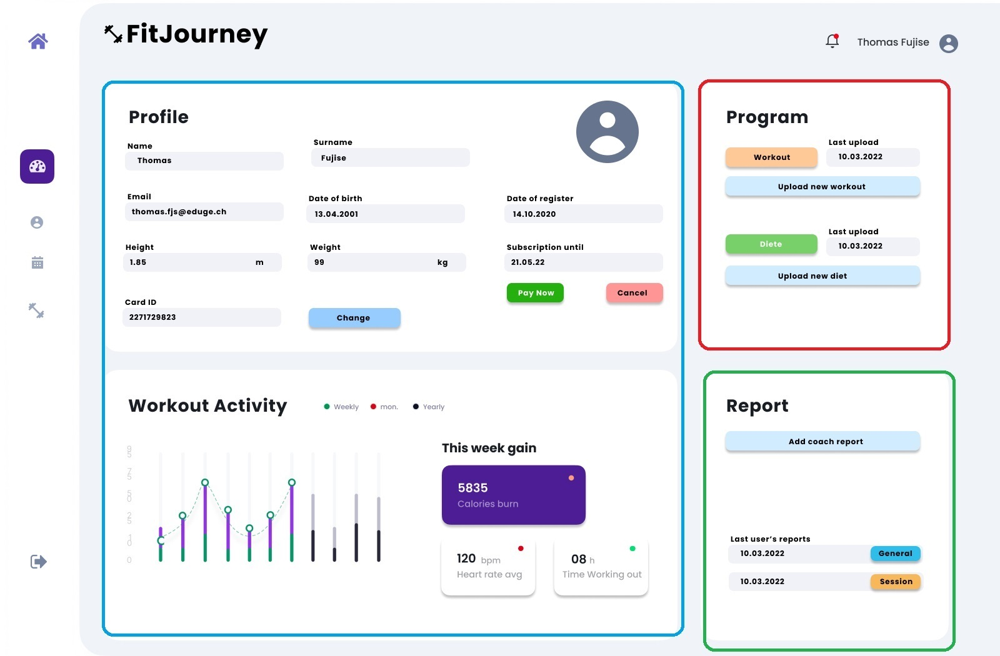

La page profil client permet au coach de visionner le profil de ses clients (en bleu). Plusieurs boutons sont disponibles :

* 1 bouton pour le changement de la carte de membre (Bouton bleu)
* 1 bouton pour le renouvellement de l'abonnement (Bouton vert)
* 1 bouton pour l'annulation de l'abonnement (Bouton rouge)

Il peut également voir les graphiques/statistiques disponibles sur le profil.

Le coach peut ajouter les nouveaux programmes du client (en rouge) à l'aide des boutons d'importation (1 bouton pour le programme d'entrainement et 1 bouton pour le programme de nutrition). Les anciens programmes sont disponibles en cliquant sur les boutons du programme souhaité (bouton vert et orange), leurs dates d'importation sont affichées à côté.

Dans la zone verte, on peut retrouver les différents bilan de satisfaction que le client a ajouté. En haut de cette zone, un bouton d'ajout de bilan est disponible. Il va permettre d'effectuer le bilan du client et d'ajouter les nouvelles informations (Poids, Masse graisseuse, etc)

##### Page Bilan client
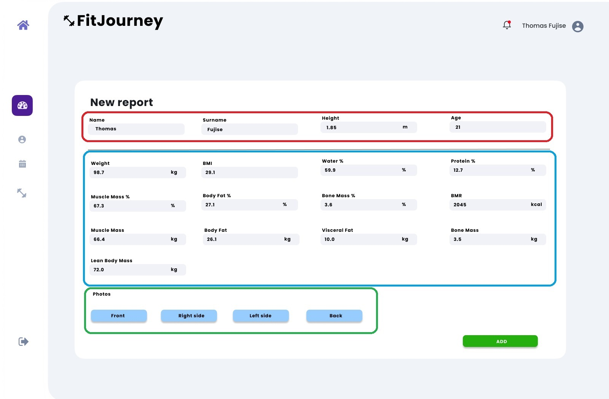


La page Bilan client permet au coach d'ajouter le bilan d'un client.

Dans la zone rouge, on retrouve les infos qui changent le moins voire jamais (Nom, taille ou encore l'âge).

Dans la zone bleue, les informations importantes qui ont pu être récupérées suite à la pesée.

Dans la zone verte, il est possible d'ajouter des photos du physique du client pour pouvoir éventuellement avoir des avant/après en guise de comparaison.

##### Page Abonnement


La page abonnement permet de valider le paiement d'un client (Aucune transaction n'est effectué par l'application). Le coach peut séléctionner le type d'abonnement que le client souhaite prendre, la date d'échéance du nouvel abonnement séléctionné ainsi que son coût seront affichés.

##### Page Calendrier
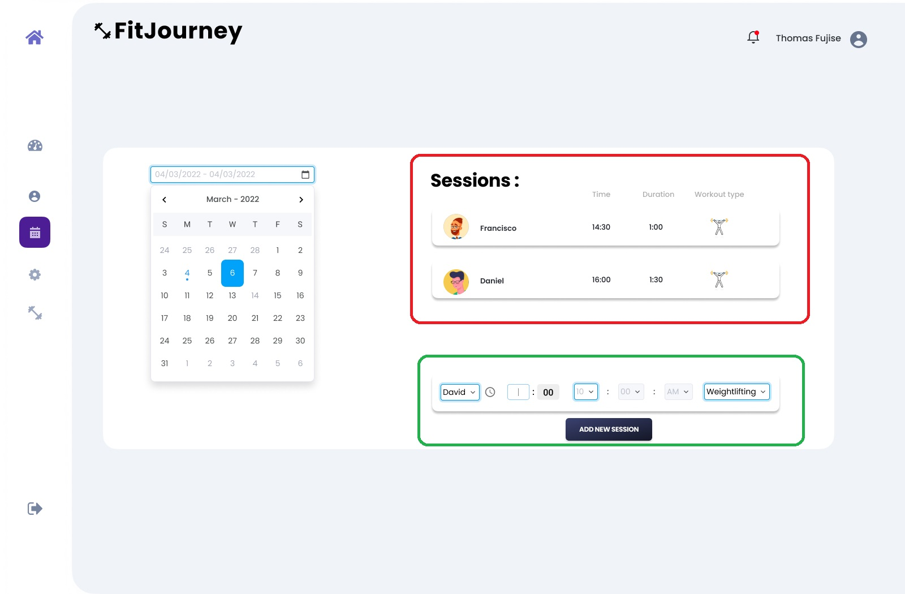

La page calendrier permet au coach d'avoir accès à un calendrier et de visionner les rendez-vous enregistré à la date séléctionné. Les sessions enregistrés sont affichés dans la zone rouge, avec quelques détails sur la séance.

Dans la zone verte, un bouton pour ajouter une nouvelle session avec un client est disponible. Le coach doit renseigner :

* Le nom du client (Liste déroulante parmis ses clients)
* L'heure de la session
* La durée
* Le type de session 


## Analyse Organique

### Mise en place / Envirronement

#### Installation (reprise du projet)

#### Visual Studio Code
J'ai choisi d'utiliser Visual Studio code pour éditer mon code, il est directement relié à mon repo sur Github. Je peux donc directement depuis Visual Studio Code commit tous les changements que j'effectue.

#### Mkdocs 
Mkdocs permet de générer un site statique pour la documentation. Il prend en compte tous les fichiers Markdown (.md) dans le dossier *docs/*, et un fichier de configuration YAML qui se trouve à la racine du projet. Mkdocs me permet de visionner mes fichiers Markdown en direct et à l'aide de l'extension *with-pdf*, de générer un fichier PDF de me tous mes fichiers Markdown.

#### GitHub
{width=200 align="right"}

Pour pouvoir garder un suivi constant de mon projet, j'ai choisis d'utiliser GitHub comme outil de contrôle de version.

Voici comment est structuré le github :


* Le dossier docs/ contient les fichiers de documentation et de journal de bord
* Le dossier src/ contient tout le code source de l'application
 
#### Trello
{width=200 align="right"}

Trello est un outil de gestion de projet en ligne, inspiré par la méthode Kanban. Il repose sur une organisation des projets en planches listant des cartes, chacune représentant des tâches. 

Afin de créer une roadmap pour mon projet, j'ai utilisé Trello pour lister les différentes étapes de mon projet. J'ai ensuite pu définir les échéances pour chaque tâches/étapes avec mon planning prévisionnel.

J'ai créé 5 colonnes :

* Backlog (Liste de toutes les tâches)
* To-Do (Les tâches qui ont été validées et qui sont à faire)
* Doing (Les tâches en cours)
* Testing (Les tâches en cours de test)
* Done (Les tâches terminées)

### Technologies utilisées

#### Python Flask (backend)
Flask est un micro-framework Python qui permet la création d'applications web évolutives. Flask dépend de la boite à outils WSGI (Web Server Gateway Interface) de [Werkzeug](https://werkzeug.palletsprojects.com/en/2.0.x/) et du moteur de templates [Jinja](https://jinja.palletsprojects.com/en/3.0.x/). Le dossier *app/* représente une application Flask, elle est entre-autre homogène à une fonction WGSI.


##### Installation Flask
En premier lieu, il faut disposer d'une version à jour de PIP afin d'installer Python Flask avec la commande :

```
pip install Flask
```

##### Utilisation Flask
Pour lancer une application Flask, il faut utiliser la méthode de l'objet Flask : 
```
.run()
```
ou lancer directement l'application à l'aide de la commande : 
```
Flask run
```

##### Micro framework
Un micro framework est un framework qui tente de fournir uniquement les composants absoluments nécessaires à un développeur pour la création d'une application. Par exemple dans le cas d'une application Web, un micro framework peut être spécifiquement conçu pour la construction d'API pour un autre service/application.

Le terme *micro* dans le micro framework signifie que Flask vise à garder le code de base simple mais extensible. Flask ne prendra pas beaucoup de décisions, par exemple quelle base de données utiliser. Les décisions qu'il prend, telles que le moteur de templates à utiliser, sont faciles à modifier. Tout le reste est libre, de sorte que Flask puisse répondre à tous nos besoins et à tous ce que vous ne voulez pas en même temps.

En définissant uniquement le moteur de templates et un système de routes, Flask laisse le choix de personnaliser (en ajoutant des packages) pour la gestion des formulaires par exemple.

##### Choix dans le projet
Dans le cadre de ce projet, j'ai préféré utiliser Flask comme framework à la place d'un autre car j'utilise l'API Polar Accesslink qui est fait en Python. Je souhaitais garder le même langage pour éviter de partir dans tous les sens.

##### Architecture (Blueprint)
Afin de bien structurer mon projet, j'ai décidé d'utiliser les Flask Blueprint. Chaque Flask Blueprint est un objet et fonctionne de manière très similaire à une application Flask. Ils peuvent tous les deux avoir des ressources, comme des fichiers statiques, des templates et des vues qui sont associés aux routes.

Malgré tous, un Flask Blueprint n'est pas exactement comme une application Flask car il a besoin d'être enregistré dans l'application pour être lancé. Lorsqu'on enregistre un Blueprint à l'application, on étend l'application avec le contenu du Blueprint. Les Blueprints enregistrent toutes les opérations à exécuter et ne les exécutes qu'une fois enregistré dans l'application

Les Blueprints m'ont permis de découper l'application en plusieurs parties et de structurer mon projet de la manière suivante : 

```
run.py
|
apps/
|
├── authentication/
|   ├── __init__.py
|   ├── forms.py
|   ├── models.py
|   ├── routes.py
|   └── util.py
|
├── client/
|   ├── __init__.py
|   ├── forms.py
|   └── routes.py
|
├── coach/
|   ├── __init__.py
|   ├── forms.py
|   └── routes.py
|
├── static/assets/
|   ├── css/
|   ├── fonts/
|   ├── img/
|   ├── js/
|   └── vendor/.py
|
├── templates/
|   ├── accounts/
|   ├── client/
|   ├── coach/
|   ├── includes/
|   └── layout/
|
|── __init__.py
└── config.py

```

#### Fichier "run.py"
Le fichier run.py est le seul fichier qui est en dehors du dossier principal de l'application. Il permet de créer et de lancer l'application Flask. On peut lancer directement l'application en exécutant ce script.

```
python3 ./run.py
```

#### Dossier "Apps"
Le dossier *Apps* est le dossier principal de l'application. Il comprend l'ensemble du code source du projet excepté le fichier "run.py". Il comprend lui-même plusieurs sous-dossiers expliqués dans les chapitres suivants.

#### Dossier "authentication"
Le dossier *authentication* représente le Blueprint *authentication_blueprint*. On retrouve tous les fichiers utilisés pour l'implémentation des fonctionnalités d'authentification. Avec Flask, j'implémente un ORM nommé SQL Alchmey qui implémente le design pattern *Data Mapper* pour lire les données de la base de données. Chacune des tables est représentée par un modèle qui est utilisé pour interagir avec la table en question.

Sachant que l'application *FitJourney* n'a pas de fonctionnalités disponible avant que l'utilisateur ne s'authentifie, le fichier "models.py" se trouve dans ce dossier, on y retrouve notamment tous les modèles.

#### Fichier "authentication/routes.py"
Le fichier *routes* contient des fonctions python représentant les *vues* de la partie authentification de l'application. Chaque fonction permet de générer une vue à partir des templates Jinja2, à l'aide de la fonction Flask *render_template* qui provient du package *Flask.templating*.

#### Dossier "client"
Le dossier *client* représente le Blueprint *client_blueprint*. On retrouve tous les fichiers utilisés pour l'implémentation des fonctionnalités client. 
Il contient un fichier de routes, avec toutes les routes disponible en tant que client sur l'application et un fichier "forms.py" qui contient tous les fomulaires qui peuvent être disponible en tant que client.

#### Dossier "coach"
Le dossier *coach* représente le Blueprint *coach_blueprint*. On retouve tous les fichier utilisés pour l'implémentation des fonctionnalités coach. Comme le dossier "client" il contient également un fichier de routes et un fichier "forms" pour les formulaires.

#### Dossier "static/assets"
Le dossier "assets" qui se trouve dans le dossier "static" contient tous les dossiers "support" de l'application comme le CSS ou encore le javascript.

#### Dossier "assets/css"
Le dosssier "css" contient tous les fichiers CSS de l'application. Il contient également un dossier "bootstrap" contenant des fichiers de style de l'ensemble Bootstrap

#### Dossier "assets/fonts"
Le dossier "fonts" contient les fichiers de police d'écriture utilisés dans l'application

#### Dossier "assets/img"
Le dossier "img" contient toutes les images de l'application dont notamment les photos de profil des utilisateurs.

#### Dossier "assets/js"
Le dossier "js" contient tous les fichiers JavaScript nécessaire pour l'application.

#### Dossier "assets/vendor"
Le dossier "vendor" contient toutes les bibliothèque tierce qui sont nécessaire au projet (ressources externe). C'est généralement dans ce dossier ou sont stocker les dependance à télécharger avec un packet manager.

#### Dossier "templates"
Le dossier templates est structuré en plusieurs parties. Il contient les fichiers .html de l'application. Chaque Blueprint de l'application possède son dossier ici qui contient les templates nécessaire pour les vues. En plus des dossiers représentant les Blueprints, un dossier includes est disponible. Il contient les parties à inclure sur les différentes pages de l'application comme la barre de navigation ou encore les importations de fichiers CSS ou JavaScript. Il y a également un dossier layout qui contient un fichier de base .html qui contient la structure HTML de l'application.

#### Fichier "__init.py"
Le fichier "init" est un fichier python contenant les méthode d'initialisation de l'application. C'est notamment ici que les blueprints sont enregistrés dans l'application.

#### Fichier "config.py"
Le fichier "config" est un fichier python contenant la configuration de l'application. Il contient toutes les constantes nécessaire au fonctionnement de l'application

### Base de données
Pour permettre le stockage des données, j'ai créé une base de données nomées "fitjourney". Cette base de données me permet d'enregistrer et stocker toutes les données requis pour le bon fonctionnement de l'application. 
#### MCD
Au lieu de créer la base de données directement, j'ai commencer par créer un MCD pour définir tous les besoins de l'application au niveau de la base de données. Pour faire mon MCD, je suis allé sur LucidChart qui est une plateforme de collaboration en ligne permettant la création de diagrammes et la visualisation de données et autres schémas conceptuels.

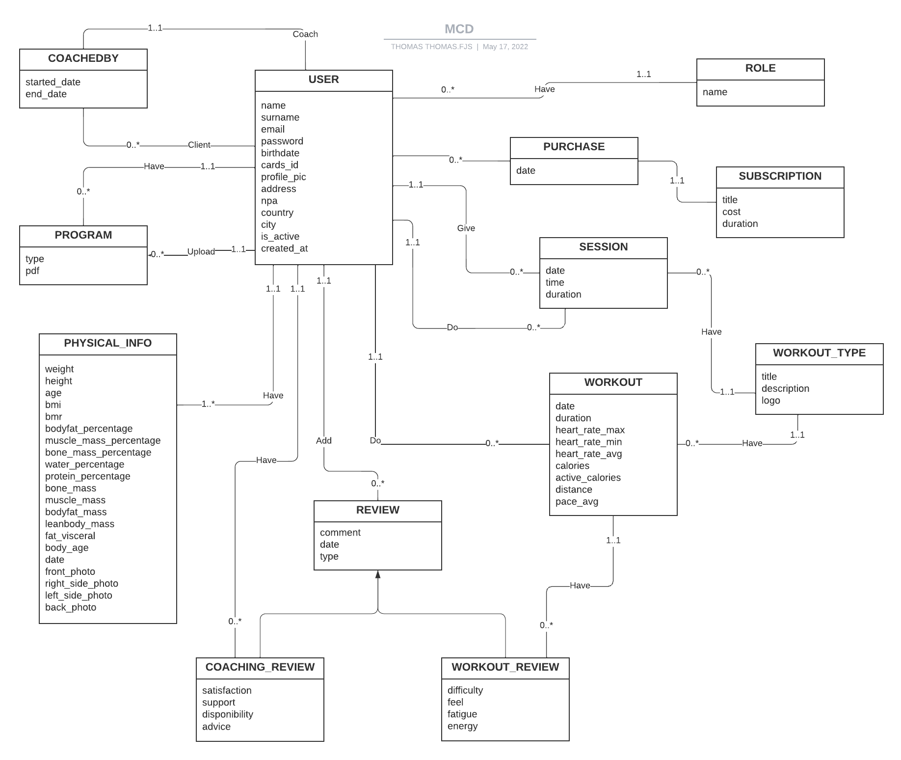

#### Modèle physique
Une fois les besoins identifiés à l'aide du MCD, j'ai pu utiliser SQL Alchemy pour créer ma base de données directement. 

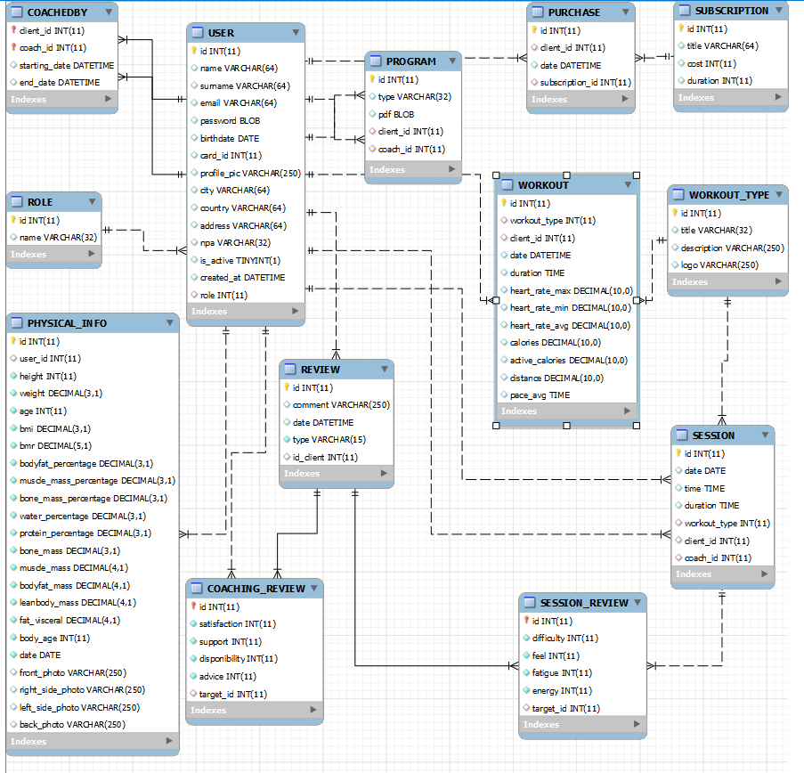
#### SQLAlchemy
SQL Alchemy est un ORM (mapping objet-relationnel) écrit en Python, il utilise le pattern [Data Mapper](#data-mapper) et me permet de créer directement mes tables.

Exemple d'initialisation d'une table avec SQL Alchemy : 


#### Data Mapper 
Data Mapper est un pattern qui sépare les objets en mémoire de la base de données. Il consiste à transférer les données entre les deux et à les isoler l'une de l'autre. Avec le pattern *Data Mapper*, les objets en mémoire ne doivent même pas savoir qu'une base de données est présente, ils n'ont pas besoin de code d'interface SQL, et certainement pas de connaissance du schéma de la base de données. (Le schéma de la base de données ignore toujours les objets qui l'utilisent). 


#### Accès
#### Données de tests
#### Tables

##### Table *USER*
La table *USER* contient tous les utilisateurs de l'application, les coachs ainsi que les clients. les champs *email* et *card_id* sont uniques. Le champ *card_id* représente l'ID de la carte de membre (RFID) qui est attribuée à l'utilisateur.

##### Table *PHYSICAL_INFO*
La table *PHYSICAL_INFO* contient toutes les informations physiques récupérées par le coach lors d'un bilan ou d'une prise en charge. La date permet de garder un historique pour visualiser la progression du client. La plupart des données insérées dans cette table peuvent être récupérées à l'aide d'une balance connectée.

##### Table *COACHEDBY*
Cette table permet de différencier un coach d'un client et permet de retrouver tous les clients d'un coach. Les dates de début et de fin permettent de retrouver des anciens coachs/clients si plusieurs coachs travaillent dans la salle de sport.

##### Table *PROGRAM*
La table *PROGRAM* contient les programmes d'entrainement et de nutrition ajouté par un coach.

##### Table *ROLE*
La table *ROLE* contient tous les rôles de l'application. Elle permet de définir les accès que possèdent les utilisateurs.

##### Table *PURCHASE*
La table *PURCHASE* contient l'historique de toutes les transactions effectuées. Elle permet de retrouver le type d'abonnement que chaque client a souscrit.

##### Table *SUBSCRIPTION*
La table *SUBSCRIPTION* contient tous les différents types d'abonnement disponible. Elle permet de connaître la durée et le coût des abonnements souscrient par les clients.

##### Table *SESSION*
La table *SESSION* contient l'historique de toutes les sessions effectuées par les coachs avec la date et l'heure de la session ainsi que sa durée. Pour rappel, une session représente un rendez-vous avec un coach. Cela peut être pour un entrainement ou encore un bilan.

##### Table *WORKOUT_TYPE*
Cette table contient les différents type d'entrainement. Elle permet d'identifier les entraînements effectués par les clients.

##### Table *WORKOUT*
La table *WORKOUT* contient toutes les données d'entraînements des séances effectuées. La majorité des données sont obtenues à l'aide des capteurs sur les montres connectées. Les données contenues dans cette table permettent de vérifier l'efficacité et l'intensité de la séance et peuvent être utilisés pour des comparaisons.

##### Table *REVIEW*
La table *REVIEW* est la table "mère" des 2 tables : *COACHING_REVIEW* et *SESSION_REVIEW*. Elle permet de relier les reviews aux clients.

##### Table *COACHING_REVIEW*
Cette table contient tous les retours client sur le coaching effectué par le coach. Les champs disponibles ont la satisfaction, le support le coach lui apporte, la disponibilité du coach en cas de besoin et si le client souhaite continuer son suivi.

##### Table *SESSION_REVIEW*
Cette table contient tous les retours client sur les sessions qu'il effectue avec un coach. Les champs disponibles sont la difficulté, le ressenti de la séance, le niveau de fatigue à la fin de la séance et l'énergie que le client avait en arrivant.


### Routage de l'application

Le **routage** de l'application signifie mapper les URL à une fonction spécifique qui gérera la logique de cette URL. Dans mon application, chaque route est relier au blueprint correspondant.

Endpoint public - Visiteur

| Méthodes  |  Endpoint |   | Description  | 
|---|---|---|---|
| POST | /login  |   |   |
| POST | /register |   |   |
| GET  | /index | | |
|---|---|---|---|

Endpoint privé - Client

| Méthodes  |  Endpoint |   | Description  | 
|---|---|---|---|
| POST | /login  |   |   |
| POST | /register |   |   |
|---|---|---|---|

Endpoint privé - Coach

| Méthodes  |  Endpoint |   | Description  | 
|---|---|---|---|
| POST | /login  |   |   |
| POST | /register |   |   |
|---|---|---|---|