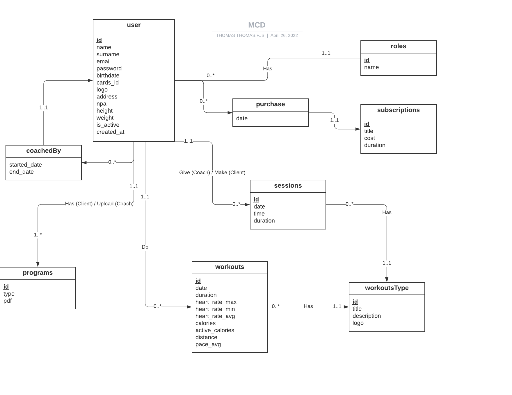
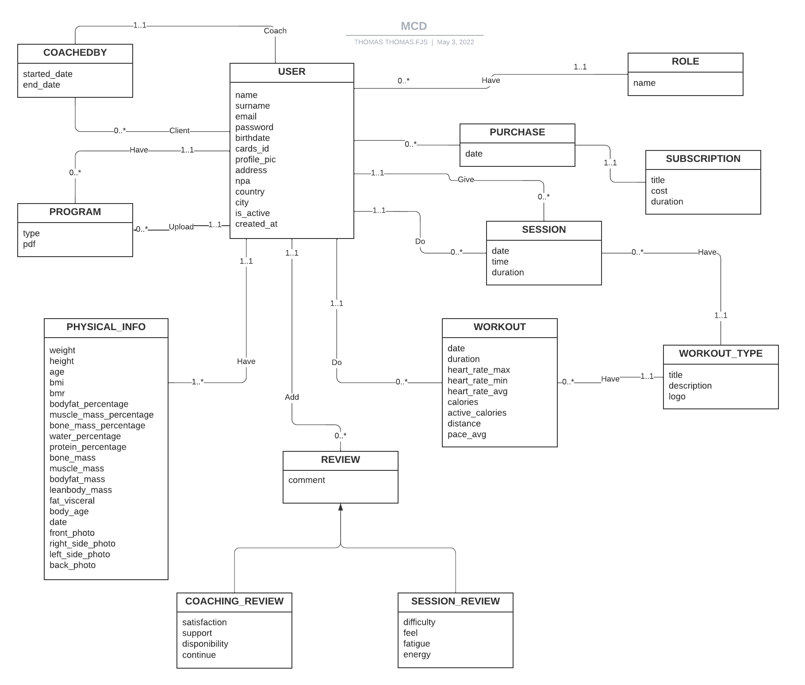
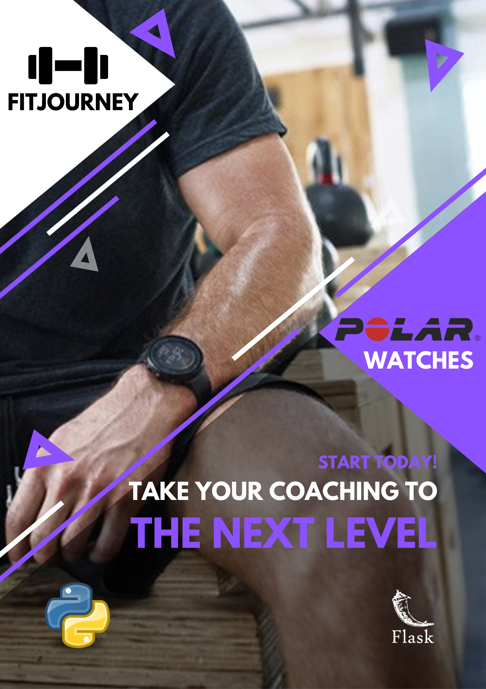
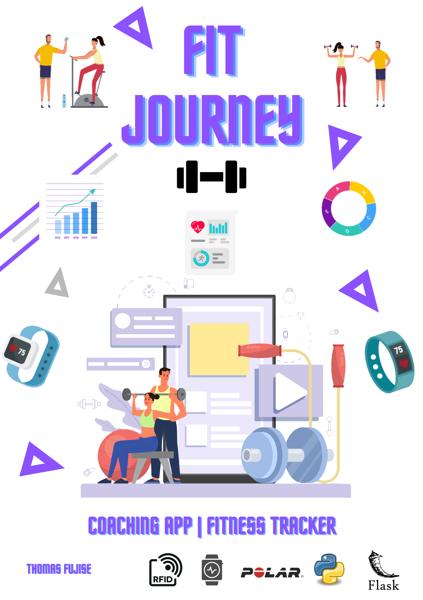

## Journal de bord - Thomas Fujise 

### Lundi, 04 Avril 2022
Premier jour du travail de diplôme, il faudrait réussir à mettre en place l'environnement de travail aujourd'hui. Suite à la présentation du déroulement du TD, je change de salle pour m'installer dans la salle à côté. Je vais prendre contact avec M. Jossi, qui est responsable du suivi de mon projet, pour connaitre ses exigences en ce début de projet. Je commence à lister les backlogs identifiables à ce stade sur un Trello. Je réalise en parralèle le planning prévisionnel sur Excel. La journée se termine un peu plus tôt (vers 15h) car nous avons une visite à l'HEPIA.

### Mardi, 05 Avril 2022
Deuxième jour du travail de diplôme, aujourd'hui il faut que j'avance un maximum sur le planning prévisionnel et l'identification des backlogs. J'ai rajouté les difficultés, la priorité et les dépendances sur les tâches dans le Trello. Cela me permet de mieux m'organiser dans l'exécution de tous les backlogs. M. Garcia est venu vers moi pour définir le nom de mon projet (je l'avais appelé "CoachingTools" par défaut), j'ai finalement décidé de nommer mon projet "FitJourney". Je vais terminer de définir les backlogs avant la fin de la journée.

### Mercredi, 06 Avril 2022 
Aujourd'hui, je vais modifier encore quelques détails sur mon planning prévisionnel avant qu'il soit terminé. Le planning prévisionnel est donc terminé ainsi que l'identification des backlogs (du moins ceux identifiables à ce stade). Je vais commencer le maquettage des interfaces avec Figma. Pour les maquettes je vais essayer de faire quelque chose d'assez simple, pour éviter de prendre trop de temps sur cette tâche. Je n'avais pas beaucoup utilisé Figma auparavant mais j'ai réussi à bien prendre l'outil en main durant la matinée. J'ai pu terminer déjà quelques maquettes (Profil, Login, Register) et bientôt celle du tableau de bord pour coach. J'ai pu avancer sur les maquettes, il ne me manque plus que la maquette de la page pour créer  une séance avec un coach. J'ai pris étonnamment beaucoup moins de temps que prévu pour réaliser les maquettes. Je vais donc pouvoir très bientôt commencer à coder. **RAPPEL**: Il faut que je commence la documentation demain pour déjà documenter les maquettes que j'ai réalisées. 

### Jeudi, 07 Avril 2022
Aujourd'hui, je vais terminer les maquettes et commencer la documentation technique. Je vais documenter déjà toutes les maquettes que j'ai réalisé pour ne pas avoir à le faire plus tard. J'ai pu terminer les maquettes avant la fin de la matinée. Il faut maintenant que je créer la structure de la documentation technique, je pourrai ensuite commencer à documenter les maquettes que j'ai réalisé. 

Suite à une discussion avec un ami coach, j'ai découvert l'existence d'une solution similaire à mon projet [Inithy](www.inithy.com). Inithy propose globalement les mêmes fonctionnalités que FitJourney à l'exception que leurs application est orienté coaching à distance là ou moi je m'oriente plus sur le coaching en salle (d'ou les cartes de membres RFID). Inithy est toujours au stade de démo, il faut les contacter pour avoir un accès à leurs application qui n'est pas encore ouvert à tous.

Je vais leurs envoyer une demande pour essayer d'avoir accès à leurs application et pouvoir analyser leurs application un peu plus en détail.

J'ai pu commnecer la documentation des maquettes que j'ai réalisé.
J'ai eu une réflexion sur l'enregistrement d'un nouveau coach, j'envisage deux cas possible :

* Soit l'application est délivré avec un compte coach(admin) et le formulaire d'enregistrement n'est disponible que lorsqu'on est authentifié en tant que coach(admin) (C'est le coach qui rempli le formulaire pour les nouveaux clients)
* Soit rajouter un champ lors de l'inscription avec un code pour créer un novueau compte coach.

### Vendredi, 08 Avril 2022
Fin de la première semaine sur ce travail de diplôme, j'ai pu commencer la documentation et documenter les maquettes que j'ai réalisé. Suite à ma réflexion sur l'enregistrement d'un nouveau coach, j'ai décidé de simplement rajouter une option sur le formulaire d'enregistrement pour créer un compte coach. 
Si une personne venait à créer un compte coach sans l'être ce ne serait pas très dérangeant car un coach n'a accès qu'aux comptes des clients qu'il suit et pour suivre un client il faut que le client confirme de son côté.

Pour un client 2 manières d'avoir un compte :

* Par le formulaire d'enregistrement au préalable, le coach n'aura qu'a séléctionner le profile client lors de la prise en charge.
* Par le coach (un coach peut créer un compte lors de l'ajout d'une prise en charge d'un client, le compte sera créer avec les infos basiques qui seront demandées (Nom, prénom, date de naissance, adresse) et un mot de passe est généré pour permettre au client de se connecter plus tard)

J'ai ajouté la structure de l'application et initialisé les blueprints.
(Les blueprints permettent de séparer l'application en plusieurs modules qui sont ensuite importé au même endroit)

J'ai créer un fichier de config qui permet d'avoir 2 mode : 

* Debug
* Production 

Qui permet d'avoir des paramètres différents. J'ai également ajouté un fichier run qui permet de lancer l'application. Il charge la configuration correspondant au mode actuel (Debug/Production) et run l'application Flask.


### Lundi, 11 Avril 2022

Début de la deuxième semaine du travail de diplôme, aujourd'hui je vais commencer mes pages HTML. Je pense que cela risque de prendre un peu de temps mais en tout cas les maquettes que j'ai réalisé vont me faire gagner pas mal de temps. J'ai réussi à créer une structure de base pour les fichiers html. J'ai décidé d'utiliser *Sneat* qui est un thème css open-source publié par [ThemeSelection](https://themeselection.com/) sous licence MIT. J'ai ajouté un fichier HTML pour les liens CSS qui sera inclus dans toutes mes pages. 

M. Maréchal est venu voir l'avancer du projet car il va superviser mon travail de diplôme de "loin". M. Jossi reste mon suiveur principal. M. Maréchal m'a conseillé de faire un diagramme explicatif du fonctionnement de l'application.

J'ai ajouté la route par défaut pour pouvoir tester une page index avec le css (pour vérifier que tout marche bien). Pour l'instant, je n'ai pas de problème tout à l'air de fonctionner comme il faut. J'ai fait une class "prototype" Users avec SQLAlchemy pour empêcher des erreurs bloquantes avec Flask-Login.

Flask-Login est une librairie qui permet de gérer les sessions utilisateurs pour Flask. (Flask-Login gère les connexions, déconnexions et garde la session utilisateur pour savoir l'utilisateur connecté ou qui vient de se déconnecter)

J'ai maintenant une page index qui peut afficher des composants à l'aide du thème CSS Sneat. Demain je poursuivrai la création de mes pages HTML et il faut également que je commence à rajouter des éléments dans la documentation 

**Ne pas oublier d'avancer la documentation**

### Mardi, 12 Avril 2022
Aujourd'hui je vais essayer de terminer la partie authentification de l'application (Login/Register). J'utilise FlaskForm pour créer mes formulaires et je pense utiliser Mashmallow pour valider les champs en relation avec la BD (Je regarde quelques exemples d'utilisation avec SQLAlchemy : [Exemple](https://marshmallow.readthedocs.io/en/stable/examples.html)).

Il faut également que je fasse le diagramme qui m'a été conseillé par M.Maréchal pour la description du fonctionnement de l'application. 

Pour la sécurité des mots de passe j'ai déjà rajouté 2 méthodes pour permettre de hasher et de vérifier les mots de passe. J'utilise la librairie Python hashlib qui me permet d'hasher les mots de passe avec un salt. Pour éviter d'enregistrer le salt en base, le salt est hashé en *sha256* et est placé avant le mot de passe dans la chaine. Comme un *sha256* a toujours 64 caractères, pour vérifier le mot de passe je saute les 64 premiers caractères de la chaine pour pouvoir comparer avec la saisie de l'utilisateur.

J'ai pu faire un diagramme explicatif des différents processus lors de l'utilisation de mon application en fonction de notre rôle (Client, coach)

[Image](./img/diagram.png)

J'ai également terminé le login (le register ne devrait pas prendre beaucoup de temps). J'ai eu quelques soucis pour inclure les formulaires avec FlaskForm (avec les imports python). J'ai ajouté une navbar pour mes pages qui servira pour la navigation dans l'application. J'ai juste encore quelques soucis avec le css mais ce n'est pas du tout prioritaire pour le moment. 

J'ai regardé pour utiliser un outil de génération de documentations, je pense utiliser Pdoc qui à l'air assez complet et qui permet de générer la documentation sur les librairies inclues dans le projet.

### Mercredi, 13 Avril 2022
Dernier jour avant les vacances de pâques, j'essaye d'intégrer pdoc à mon projet mais lorsque je lance la commande pour générer le doc j'obtiens une erreur. Il n'arrive pas à trouver *apps* qui est le dossier principal. 

J'ai pris un peu de retard par rapport à ma planification initiale mais j'ai avancé sur des points que j'étais censé effectuer plus tard dans le projet donc au final je n'ai pas beaucoup de retard. Je vais juste terminer encore ma page register qui va de pair avec la page Login. Il faudra ensuite que je commence à documenter tous le back-end que j'ai déjà effectué. Je pourrai ensuite commencer à travailler sur la base de données car pour le moment j'utilisais une base de données temporaire pour tester mon login. 

En faisant des tests sur le login je me rends compte que j'ai une erreur qui s'affiche lors de la connexion. Lorsque j'effectue la requête pour voir si le mail que l'utlisateur a saisit existe je ne rencontre aucune erreur si le mail inséré n'est pas dans la base mais lorsque le mail rentré se trouve dans la base de données alors une erreur s'affiche : 

```
string argument without an encoding 
```

Après quelques heures d'incompréhension sur cette erreur, je viens d'en trouver la raison. J'avais seulement mit le mauvais type dans l'initialisation du champ mot de passe avec SQLAlchemy.

J'ai enfin finis le register et le login, tout fonctionne comme il faut. Je n'ai plus qu'a rajouter les champs que je veux dans le register (tout le back-end est fonctionnelle). Je vais commencer à documenter les points que j'ai avancé jusque là je pourrai ensuite commencer à travailler sur la base de données.

J'ai pu commencé à documenter l'envirronement de mon projet mais il reste encore beaucoup de point que je peux documenter déjà maintenant. Pour avancer la documentation en même temps que le projet je vais faire ça en priorité et je continuerai sur la base de données une fois la documentation à jour.

### Lundi, 25 Avril 2022
Retour de vacance, je n'ai malheureusement pas pu énormément avancer pendant la semaine et demie de vacance. Le premier rendu intermédiaire a lieu demain. Je vais terminer le diagramme UML que j'ai commencé pour la base de données. J'utilise l'application WEB [dbdiagram.io](dbdiagram.io) qui permet de créer un diagram et de l'exporter directement en SQL par la suite. 

Ma machine a eu un blue screen qui a été très long (30min) à redémarrer. Je n'ai malheureusment pas eu le temps de sauver le diagram que j'avais quasiment terminé, je vais devoir recommencer.

J'ai pu terminer le diagramme UML à l'aide de dbdiagram.io :


Je peux maintenant commencer la création des tables avec SQLAlchemy.
J'ai découvert un outil qui est actuellement en BETA [dbdocs](dbdocs.io) qui permet de générer une documentation WEB d'une base de données. Je regarderai l'outil un peu plus en détail plus tard mais je pense que cela pourrait être une bonne idée d'avoir cette documentation en plus de celle qui sera présente dans le document de documentation technique.

Je viens de me rendre compte que je n'avais pas créé le planning effectif pour l'instant. J'ai dupliqué le planning prévisionnel et effectué les quelques modifications pour le planning effectif.

M.Jossi est venu voir l'avancement du projet. Nous avons discuté de plusieurs points notamment le diagramme que j'avais fait pour expliquer l'utilisation de l'application. Le diagramme que j'ai fait était  un mix d'un sitemap et d'un diagramme de cas d'utilisation. Je vais donc les refaire séparément. Je vais également faire un MCD pour être sûr de ne rien oublier pour ma base de données. Je pourrai ensuite poursuivre la création de ma base avec SQLAlchemy.

Pour l'évaluation intermédiaire, M.Jossi m'a demandé de remplir la grille d'évaluation de mon côté et nous referons un point mercredi pour voir si tout est ok.

### Mardi, 26 Avril 2022
Aujourd'hui je dois compléter la grille pour la première évaluation intermédiaire comme convenu avec M.Jossi.

J'ai pu terminer les 2 sitemaps pour le client et le coach. 


Je vais maintenant faire le MCD que j'aurai dû faire avant le MLD pour être sûr de n'avoir rien oublier. Il faudrait que j'avance la documentation sur les diagrammes que je suis en train d'effectuer. J'ai pu terminer le MCD, je le ferai vérifier par M.Jossi car j'ai quelques doutes sur certains points. Je ne sais pas si, dans mon cas, il n'est pas mieux de faire une classe mère (Users) avec 2 enfants (Clients et coachs) pour le MCD.



J'ai ajouté les objets SQLAlchemy en fonction du MCD que j'ai fait au préalable. Je me suis rendu compte que certaines tables devront être remplies au préalable ou je devrais rajouter des écrans pour pouvoir les remplir. Un coach n'a pas moyen d'ajouter un type d'entrainement (la table 'workoutsType') ni d'ajouter un type d'abonnement (table subscriptions). Les relations ont l'air de fonctionner avec SQLAlchemy je vais pouvoir adapter les formulaires de register et login que j'ai fait au préalable pour tester.

J'ai mis également à jour le Trello que je n'avais plus touché depuis quelques jours.


### Mercredi, 27 Avril 2022
M.Jossi devrait passer aujourd'hui à la pause pour faire un point et faire l'évaluation intermédiaire comme convenu. 

Je vais adapter les formulaires de login/register à la nouvelle base de données. Je viens de me rendre compte que le champ 'DateField' dans mon formulaire, que j'utilise pour renseigner la date de naissance de l'utilisateur s'affiche comme un input texte basique. Pour avoir un input de type *date* j'ai utilisé le champ 'DateField' mais depuis *wtforms.fields.html5*.

J'ai rencontré un nouveau problème, en premier les validations des champs du formulaire ne s'effectuait pas correctement. J'avais en fait simplemenet oublier d'utiliser un SubmitField (j'utilisais un input HTML en dur à la place). Les validateurs fonctionnent sauf ceux du mot de passe qui sont sensés vérifier que les 2 mots de passes saisient soit identiques. Le formulaire se valide et prend en compte uniquement le premier mot de passe saisit.
 
J'ai trouvé pourquoi les mots de passe ne se vérifiaient pas, je passais directement à la création de l'utilisateur lors du clique sur le bouton 'register'. Les champs se vérifiaient "eux-même" par rapport au type de données saisient mais le check si les 2 inputs étaient identiquent ne s'effectuaient donc pas. J'ai donc changé ma condition pour que je poursuive la création de l'utilisateur uniquement lors de la validation du formulaire. 

J'ai réussi à adapter le login et le register avec les bons champs, il ne manque plus qu'a ajouter l'affichage des erreurs.

M.Jossi est passé pour l'évaluation intermédiaire. Globalement tout est ok, j'ai juste prit un léger retard avec toute la mise en place du système que j'avais légèrement sous-estimé. Pour la documentation, j'ai quelques points a ajouter/modifier :

* Ajouter les sitemaps 
* Modifier le MCD (Pas de flèches, revoir les cardinalitées, double relations pour coach/client)
* Ajouter Installation pour le projet en général (pas seulement Python Flask)
* Ajouter l'aborescence du dossier source (explication détaillé)
* Revoir l'ordre des maquettes (ordre logique)
* Explication des boutons sur les maquettes
* Use case dans l'analyse fonctionnelle 
* Schéma pour montrer comment l'application va intéragir avec l'API

J'ai pu terminé la modification du MCD, je vais l'envoyer à M.Jossi pour qu'il puisse vérifier. Il faut maintenant que j'avance sur la documentation.

### Jeudi, 28 Avril 2022
J'ai commencé à revoir la description de mes maquettes. Je me suis rendu compte de quelques incohérence sur certaines maquettes comme sur le tableau de bord du coach, la prochaine session était affiché tout en bas de la page. Il était donc plus cohérent d'afficher cette information tout en haut et de mettre la liste de client en bas.

J'ai également eu une réflexion sur les bilans. J'avais totalement oublié de penser au bilan qui est un élément essentiel du coaching. Je vais donc revoir les maquettes et je pourrai donc modifier le MCD quand je retournerai dessus plus tard.
Je pense rajouter 2 "types" de bilan, un bilan *général* qui sert à évaluer le ressenti du client par rapport à sa prise en charge, le suivi de manière général. Le deuxième type de bilan serait un bilan par session (qui ne serait pas obligatoire, au début cela peut ne pas déranger mais si le client effectu beaucoup de séance cela peut vite devenir répétitif) où le client note son ressenti sur la séance. Pour le coach, un bilan est effectué de manière soit hebdomadaire, soit mensuelle pour enregistrer les nouvelles mesures (poids, mensu, chrono, cela dépend du type de coaching).

Pour le bilan, les données que le coach devra renseigner à l'aide d'une balance connecté qui permets leurs acquisition sont : 

* Poids
* BMI (Body Mass Index / IMC)
* Body Fat % 
* Water % 
* Mucle Mass % 
* Bone Mass 
* BMR
* Fat Visceral
* Lean Body Mass
* Body Fat Mass
* Muscle Mass
* Protein
* Body Age

J'ai pu terminé les nouvelles maquettes, j'ai rajouter une page bilan de session pour l'utilisateur ainsi qu'une page bilan "général" pour noter la qualité du coaching. Du côté coach, j'ai rajouté la page pour effectuer le bilan général avec les informations mentionnées au-dessus. 

### Vendredi, 29 Avril 2022
Maintenant que j'ai rajouté les bilans et les avis je vais revoir le MCD. Je décide de séparer les informations physiques de la table utilisateur et d'ajouter une date dans la table information physique pour avoir un historique de l'évolution. Il faut également que j'ajoute 2 tables pour les avis (Coaching et sessions). 

Au niveau MCD, je pense que les 2 tables avis doivent être reliées à une table mère "Reviews" qui serait associée à la table *Users*. Je demanderai à M.Jossi lorsque je lui enverrai mon MCD pour qu'il puisse vérifier et me donner son avis. 

En utilisant une table mère pour les avis, je dois remonter le champ "commentaire" car c'est un champ commun entre les 2 tables avis. (Les champs d'évaluation pour les avis ne pourront donc pas être modifié sachant qu'ils représentent des champs définis dans la base de données)

Je vais encore revoir les cardinalités du MCD et je pourrai ensuite l'envoyer à M.Jossi. 

Voici le nouveau MCD :


J'ai revu également les cas d'utilisations que j'avais réalisé, j'ai décider de faire 2 schéma différent pour le client et le coach.


J'ai pu avancer sur la documentation, il faut encore que : 

* J'ajoute les navbars dans la section maquette
* J'explique plus en détail l'arborescence de l'application
* J'ajoute l'explication de l'installation générale du projet
* J'explique les 2 sitemaps
* J'ajoute le MCD 
* J'ajoute un schéma pour expliquer l'utilisation de l'API par l'application.

### Lundi, 2 Mai 2022

Aujourd'hui je vais continuer d'avancer sur la documentation et je vais également reprendre le code maintenant que j'ai un MCD plutôt correcte. M.Jossi a pu regarder la nouvelle version du MCD que je lui avais envoyé. Je dois refaire quelques modifications pour respecter les standards Ecole (nom des entités en majuscule singulier) et mettre les verbe d'association à l'indicatif si possible.

M. Jossi est passé me voir, il m'a aidé à éclaircir le passage du MCD au MLD avec la table mère *REVIEW*. Nous avons décider de ne pas prendre la table mère et de garder uniquement les tables filles car il n'y avait qu'un seul champ en commun.

J'ai du retoucher encore une fois mes maquettes pour revoir les navbars, j'ai également refait le sitemap du côté coach car j'avais oublié quelques chemins. J'ai rajouté la documentation sur les navbars de l'application.

J'ai implémenté le MCD avec SQLAlchemy pour créer les tables.

J'ai rajouté des routes pour afficher une page d'erreur en fonction de l'erreur qui survient :

* 403 pour un accès non autorisé
* 404 si la page n'est pas trouvée
* 500 si c'est un problème avec le serveur

J'ai également créé une route dynamique pour tous les templates dans le dossier templates/home, toutes les pages sont accessibles uniquement si l'utilisateur est connecté (@login_required)

Je rencontre un problème, je n'arrive pas à accéder aux pages car même une fois le login passé le login manager ne détecte pas la connexion (Il agit comme si l'utilisateur n'était pas connecté)


### Mardi, 3 Mai 2022

J'ai continué de regarder mon problème avec le login_manager hier soir, je n'ai toujours pas trouvé de solution.

Ce matin en relisant, la documentation de Flask Login, j'ai essayé d'ajouter les méthodes que la classe User doit implémenter pour que le Login manager fonctionne. Cette fois le Login manager fonctionne avec les méthodes implémentées à la main, le problème est que pour éviter de dévoir les implémenter à la main j'avais fait hériter ma classe User d'*UserMixin* qui permet l'implémentation par défaut des propriétés et méthodes nécessaires.

Donc je ne sais pas pourquoi en faisant hériter ma classe de *UserMixin* cela ne fonctionne pas mais quand j'implémente les propriétés et méthode à la main le Login manager fonctionne.

[Documentation Flask Login ](https://flask-login.readthedocs.io/en/latest/#your-user-class)

J'ai très rapidement retouché le MCD pour enlever encore les id qui ne sont pas obligatoire et j'ai juste rajouter un champ *City* et *Country* pour la table USER.



J'ai commencé à avancer sur la page profil du client. 

A la base j'avais séparé l'application en 2 gros dossiers :

* authentication/
* home/

*home/* était sensé contenir toute l'application hormis l'authentification, je pense séparer ce dossier en 2 parties :

* client/
* coach/

Je vais alors avoir quelques fichiers en double mais ils seront bien précis par rapport à leurs utilitées.

Chaque dossier doit contenir les fichiers : *routes.py*, *forms.py*, *init.py* qui seront bien sûr différents pour chaque dossier. 

J'ai pu terminer la base de la page profil, les informations du client sont affichés et peuvent être modifié. Il faut encore que je rajoute le "widget" pour les retours ainsi que l'option pour changer le mot de passe.


### Mercredi, 4 Mai 2022

J'ai pu ajouter les requêtes SQL pour afficher les données sur la page profil comme la fin de l'abonnement qui a été souscrit en dernier.

Il faut que je commence le Poster car le rendu est fixé à Lundi et je dois également poursuivre l'avancement de ma documentation pour le rendu intermédiaire qui a lieu Mardi.

Les points que je dois encore ajouter :

* Expliquer plus en détail l'arborescence de l'application
* Ajouter l'explication de l'installation générale du projet
* Détailler les 2 sitemaps
* Remplir la section Base de données
* (Ajouter un schéma pour expliquer l'utilisation de l'API par l'application.)

Je peux éventuellement aussi commencer à documenter quelques fichiers comme les routes ou encore les blueprints que j'utilise.

J'ai pu avancer sur mon poster, M.Bonvin nous a proposé de passer demain pour voir les posters et donner un retour.

Pour revenir à l'application, je dois faire une requête SQL pour récupérer les retours du client. Le problème est que les retours sont dans 2 tables différentes. J'ai cherché pendant un petit moment pour trouver une solution, et je me suis rappelé des UNION en SQL qui me permettent exactement de faire ce dont j'ai besoin. Le seul problème est que les champs gardent le nom du premier SELECT.

Donc lorsque je récupère les retours client d'un client en particulier, je les récupère dans un objet *CoachingReview* même si les données proviennent de la table *SessionReview* (Car le premier SELECT de l'UNION est celui de CoachingReview). Il faut que je trouve comment rajouter des *AS* dans ma requête SQL.

### Jeudi, 5 Mai 2022

J'ai trouvé le moyen de renommer les champs avec la méthode *label()*. J'ai donc renommé les champs du premier SELECT pour avoir des propriétés plus génériques. Je peux maintenant terminer l'affichage des retours client. 

Finallement, je vais revoir la base de données pour optimiser la récupération des retours. Actuellement, il n'est déjà pas possible de savoir de quel type est le retour car pas de champs et pour savoir quel coach était assigné au client il faut vérifier dans 2 autres tables pour la date du coaching etc. Je pense finalement garder la table intermédiaire dans le MLD, une table "REVIEW" qui comporte les points communs entre les 2 (client_id, coach_id, date, comment, type) et garder les 2 tables fille qui comporteront les champs spécifiques à chacune. J'ai mis l'ID d'une review dans la table *REVIEW* et cet ID sera la clé primaire et étrangère des tables filles.

Une fois la table intermédiaire ajoutée, je pourrai terminer l'affichage des retours ainsi que la l'affichage de leurs détails. 

Je suis bloqué sur un problème, je n'arrive pas à joindre une table récupérer à l'aide d'un *UNION* avec SQL Alchemy.

Voici la requête en SQL :

```
SELECT R.id, R.comment, R.date , R.type, I.Field1 
FROM REVIEW AS R 
JOIN (SELECT C.id AS ID, C.satisfaction AS Field1 FROM COACHING_REVIEW AS C UNION SELECT S.id, S.difficulty FROM SESSION_REVIEW AS S) AS I ON I.ID = R.id
WHERE id_client = 1
```

J'arrive à faire l'UNION avec tous les champs, seulement lorsque je veux join la table à une autre table je n'arrive pas à determiner la jointure (le *ON* ) car je ne peux pas accèder aux colonnes de la table "UNION".

La première requête qui va chercher toutes les reviews de coaching :

```
q1 = db.session.query(CoachingReview.id, CoachingReview.satisfaction.label("Field1"), CoachingReview.support.label("Field2"), CoachingReview.disponibility.label("Field3"), CoachingReview.is_continuing.label("Field4"))
	
```

La deuxième requête qui va chercher toutes les reviews de sessions :
```
q2 = db.session.query(SessionReview.id, SessionReview.difficulty, SessionReview.feel, SessionReview.fatigue, SessionReview.energy)
```

L'union entre les deux :
```
q3 = q1.union(q2)
```

Et la requête qui relie les infos de la table mère *REVIEW* aux données récupérés dans l'UNION :
```
	query = db.session.query(Review.id, Review.comment, Review.date, Review.type).join(q3,Review.id==q3.c.id).filter(Review.client_id==id)

```

La variable *q3* qui contient le résultat de l'UNION est sensé posséder les colonnes de cette table accessible depuis *q3.c* mais j'ai l'erreur : 
```
AttributeError : id 
```

En debugant les objets SQL Alchemy, j'ai trouvé pourquoi je n'arrivais pas à accéder aux champs. Les champs avaient un alias généré automatiquement. Pour régler ce problème, j'ai rajouter un nouvel alias à chaque champs et désormais tout fonctionne.

Les reviews du clients sont maintenant affichés sur sa page profil, je peux maintenant ajouter la page de détails lorsqu'on clique sur la review.

Demain je vais beaucoup travailler sur la documentation car le rendu intermédiaire à lieu lundi et il faudrait que j'ai documenté toutes les fonctionnalitées déjà effectué.

### Vendredi, 6 Mai 2022

Je viens d'ajouter le changement d'image de profil. Sachant que l'application n'est pas destinée à contenir des milliers d'utilisateurs, j'ai créé un dossier "profile/" dans le dossier "img/" de l'application. Toutes les photos de profil seront enregistrées ici avec un UUID comme nom de fichier. Le nom de fichier est enregistré dans la base de données. 

J'ai avancé un peu sur la page Workouts, il faut que je modifie la création des champs de la table 'WORKOUT' car les valeurs sont arrondies et n'ont pas de décimals.

J'ai pu terminer l'affichage des workouts effectués par le client. Cet après-midi, je vais avancer sur la documentation technique et le poster.

Pour le moment, il me manque encore l'ajout des reviews par le client ainsi que l'affichage détaillé des reviews et des workouts et l'affichage des graphiques avec Chart.JS. Une fois cela terminé, j'aurai terminé le côté client. 

La partie des graphiques avec Chart.JS sera je pense que la partie la plus "compliquée". Pour le reste de l'application, tous le côté coach est uniquement composé de formulaire et des mêmes pages que le côté client mais avec des options supplémentaires. 

J'ai pris la décision de laisser un peu de côté l'aspect "esthétique" de l'application car n'étant vraiment en avance je veux me concentrer principalement sur les fonctionnalités de l'application.

J'ai pu avancé un peu sur la documentation de la base de données. Je vais devoir revoir mon poster ce week-end, M.Bonvin m'a fait un retour : Je n'explique pas ce que mon application fait et je fais plus de pub pour Polar qu'autre chose. 




### Lundi, 9 Mai 2022

Aujourd'hui à 17h, nous avons le rendu intermédiaire. Nous devons rendre le poster, le résumé et l'abstract ainsi que l'état actuel de la documentation technique.

J'ai pu refaire un nouveau Poster plus explicit de ce qu'est mon application :



Je l'ai montré à M.Garcia qui m'a fait la remarque qu'il n'y avait pas vraiment d'ordre de procéder pour l'application (Trop d'images misent un peu partout sans sens particulier). Je vais donc reordrer les images et je devrai être pas mal.

J'ai pu avancer ma documentation technique un peu, il faut encore que j'ajoute :

* L'arborescence
* L'installation

et que je commence à expliquer les différentes routes de l'application.

Je viens de rencontrer un problème, lors du rendu en PDF avec Mkdocs, j'ai plusieurs images qui s'affichaient sur le site statique mais qui ne sont pas visible sur le PDF.

M.Jossi est passé pour voir l'avancement du projet, nous ferons un point pour l'évaluation intermédiaire Mercredi. Il m'a également fait la remarque que mon poster contenait trop d'images un peu partout. Je vais épurer mon poster et continuer d'avancer sur la documentation.

J'ai pu ajouter l'arborescence (qui n'est pas terminée vu que le projet ne l'est pas encore). 

Il faudrait encore que j'ajoute des tests utilisateurs dans la documentation pour les parties déjà terminées. 

J'ai pu modifier et alléger mon poster :


### Mardi, 10 Mai 2022

Aujourd'hui je vais avancer sur mon projet. Il faut que j'ajoute l'affichage des détails d'une review lorsque l'utilisateur clique dessus.

Je rencontre un problème, je voulais à la base passer la review (objet) en paramètre GET pour pouvoir récupérer les infos sur la page review. Mais lorsque je passe l'objet en paramètre il arrive de l'autre côté sous forme de chaine (string). Je ne peux donc pas récupérer les données comme je le souhaite car seul les valeurs sont dans la chaine, il n'y pas les indexs.

Je vois deux possibilité : 

Soit je passe l'id en paramètre et je vais refaire une requête pour chercher les infos (je vais devoir en faire deux car je ne peux pas savoir le type de la review à l'avance et en fonction du type la requête est différente)

Soit j'arrive à récupérer un objet en paramètre.

Je vais essayer de trouver un moyen de passer l'objet mais si je perds trop de temps je ferai l'option avec les deux requêtes.

J'ai pu passer les valeurs en paramètre, au lieu de passer l'objet j'ai passé toutes les valeurs séparéments. En avançant je viens de me rendre qu'il faut que j'ajoute un champ dans les 2 tables "COACHING_REVIEW" et "SESSION_REVIEW". Il faut que j'ai l'id de la session/coach concercné par la review.


J'ai rajouté les champs "target_id" aux deux tables de reviews. J'ai mis à jour les diagrammes.

J'ai pu terminer l'affichage des 2 types de reviews, je pourrai revoir encore le style éventuellement plus tard si j'ai le temps.

### Mercredi, 11 Mai 2022

Nous allons faire le point intermédiaire aujourd'hui avec M.Jossi, je pense toujours avoir un peu de retard sur le projet de manière générale.

Je rencontre un problème lors de l'ajout des charts sur la page profil. J'ai fait une requête pour obtenir les types d'entrainements qui ont été effectués un client ainsi que le nombre de séance effectué pour chaque type. Je sépare donc ces valeurs en 2 tableaux (Pour pouvoir ensuite les passer dans le Javascript et utiliser les valeurs avec Chart.JS). Seulement une fois passer du côté HTML j'ai un problème, pour tableau qui contient les valeurs numériques (int) tout va bien mais pour le tableau qui contient le titre des exercices (string) les apostrophes contenues dans le tableau pour déterminer les strings sont remplacé par : *&#34;*

Tableau avant (backend python)
```
['Weightlifting', 'Cycling']
```

Tableau après (frontend html)
```
[&#34;Weightlifting&#34;,&#34;Cycling&#34;]
```

Le problème est que je ne peux même pas remplacer les caractères indésirables car ce n'est pas une chaine mais un tableau.

Pour résoudre ce problème, j'ai fait une boucle qui parcourt le tableau reçu sur le côté template et j'ai rempli un tableau javascript avec les valeurs. J'ai ensuite remplacé les caractères indésirables des valeurs et tout fonctionnait.

En me faisant une réflexion sur l'application, je me suis rendu compte que je vais devoir modifier une maquette. Sur la maquette d'interface pour la page détail d'un entrainement, j'ai affiché un graphique qui représentait l'évolution des battements de coeur durant la séance. Malheureusement l'API Polar ne permet pas de récolter les données de toute la séance, on obtient uniquement le bpm max, min et moyen (pas de quoi afficher un graphique représentant la séance entière).

J'ai fait le point intermédiaire avec M.Jossi, dans l'ensemble je suis sur le bon chemin. Il ne faut pas que je me relâche mais j'avance dans la bonne direction. J'ai toujours un peu de retard mais je ne me fais pas trop de soucis pour l'instant. Il faut que je commence à découper le code python (séparer en fonction pour chaque requête effectuée) et il faut également que j'ajoute le guide d'installation dans la documentation. M.Jossi m'a également fait la remarque qu'il faudrait que je précise les entrées obligatoires dans les formulaires présents sur les maquettes.

J'ai pu commencer l'ajout du deuxième graphique de la page profil avec Chart.JS qui représentera le nombre d'entrainements effectués par mois.

### Jeudi, 12 Mai 2022

J'ai pu terminer le passage des valeurs pour le deuxième graphique (pour le nombre d'entrainements par mois). Je n'ai pas pu avancer l'après-midi car il y a eu l'après-midi "poster" ou tous les élèves CFC ont venu voir les projets.

### Vendredi, 13 Mai 2022

J'ai reçu un mail inquiétant de la part de Polar. Ils annoncent une maintenance le 18 Juin, je ne sais pas pour combien de temps. Sachant que la défense du diplôme a lieu le 20, je vais devoir prendre des précautions et faire une sorte de "Mock" de l'API Polar et simuler la récupération des données au cas où. Je vais quand même leurs envoyer un mail, pour connaitre la durée de la maintenance et savoir si des changements majeurs auront lieu (des changements qui risquent de rendre obsolète mon application).


J'ai remarqué que les données utilisées pour le graphique qui affiche le nombre d'entrainements par mois ne prends pas en compte l'année (si j'ai fait des entrainements en Mai 2021 et Mai 2022 il prendra la somme des 2). Je vais rajouter le critère de l'année actuelle dans la requête SQL.

J'ai pu ajouter les statistiques de la semaine à côté des deux graphiques. Il faut encore que j'affiche le total d'heures d'entrainements de la semaine, la difficulté est qu'il faut que j'utilise la fonction SQL SUM() sur des champs du type TIME (ce qui n'est pas faisable en SQL). Pour solutionner ce léger problème j'ai utilisé la fonction SQL exctract qui m'a permis d'extraire les heures, minutes et secondes de chaque durée et ainsi les additionners. 

J'ai également pu ajouter la page "Prochaine sessions" qui affichent la liste des prochaines sessions avec un coach. Pour ressembler le plus possible à la maquette j'ai ajouté dans le dossier *static/assets/img/sports* des logos de beaucoup de sports qui serviront d'illustrations pour le type de séance qui est prévu pour la session.

Je vais pouvoir maintenant commencer à séparer en différentes fonctions les requêtes SQL pour rendre plus lisible le fichier de routes.

Pour le côté client, il ne manque plus que l'affichage détaillé des entrainements et l'option changement de mot de passe. Je pourrai ensuite commencer le côté coach. Pour la documentation je vais commencer à documenter les endpoints du côté client.

### Lundi, 16 Mai 2022
Aujourd'hui, j'ai pu terminer la page détails d'entrainements, je ne me suis pas trop attardé sur le style mais la page est fonctionnelle. J'ai pu ensuite poursuivre avec la page ajout de review, je vais en faire une seule qui s'adaptera en fonction des champs qui lui sont envoyés. 

Je remarque qu'il faut que je modifie la maquette d'ajout de review sur le coaching car j'avais modifié un champ et sur la maquette l'ancien champ est toujours présent. 

J'ai eu une réflexion lors de l'élaboration de la page d'ajout de review, ne faut-il pas ajouter une review sur les entrainements plutôt que les sessions ? 

Car les sessions ne sont pas toujours des entrainements et cela ne sert à rien d'ajouter une review sur un rendez-vous pour un bilan. Il faut donc que je modifie les noms de table, les relations ainsi que les clés étrangères.

J'ai pu terminer la page d'ajout de review à 90%, il ne manque plus qu'à modifier la base de données pour que les revies soient sur les entrainements et plus les sessions et la page sera fonctionnelle pour l'ajout de review sur les entrainements. J'ajouterai les reviews coaching demain.

### Mardi, 17 Mai 2022

Je vais commencer par modifier la base de données pour passer de "SESSION_REVIEW" à "WORKOUT_REVIEW" car comme réfléchi hier, il est plus intéressant de pouvoir mettre une review sur un entrainement que sur une session car certains workouts ne sont pas une session et le retour sur ces entrainements peuvent intéresser le coach.

J'ai pu tout modifier, il faut maintenant que je fasse en sorte qu'un entrainement ne puisse avoir qu'une seule review pour éviter que l'utilisateur en publie plusieurs. 

J'ai également fait la modification de la maquette d'ajout de review sur le coaching les 4 champs n'étant plus un select mais un slider comme les autres champs.

J'ai ajouté la possibilité d'ajouter les review du coaching. Il faudrait que j'ajoute en tout cas pour l'ajout de review sur le coaching un petit carré qui montre le coach en question. Pour l'ajout de review sur un entrainement cela n'est pas forcément nécessaire sachant qu'il faut être sur la page de détail de l'entrainement pour ajouter une review.

Il faut que j'ajoute une redirection automatique lorsque la review ajouté.

Je ne sais pas si c'est un problème mais vu qu'avant de vérifier si la review d'entrainement existe je remplis la table *REVIEW* cela augmente l'id de 1 et si la review existe tout est rollback mais l'auto incrément garde l'incrément de 1.

Lors de la création de la page pour changer le mot de passe, je rencontre un problème. J'avais ajouté dans le model *User* une fonction qui permet de hash le password qui est défini sur la propriété "password" mais lorsque je change la propriété le mot de passe n'est pas hashé et si je le hash manuellement le programme plante.

La modification de mot de passe est désormais fonctionnel mais je rencontre maintenant un autre problème le *logout* ne fonctionne plus

Je n'arrive plus à logout l'utilisateur connecté, dans la route du login il y a une condition :

```
if not current_user.is_authenticated
```
sauf que même après avoir utilisé la fonction logout_user de Flask Login, je ne passe jamais dans cette condition.

### Mercredi, 18 Mai 2022

Je suis resté bloqué sur mon problème de logout presque toute la matinée, je ne trouvais absolument aucune solution logique. M. Zanardi est venu voir mon problème et nous avons debuger le logout. Nous avons découvert qu'une fois logout Flask Login se connectait automatiquement à un utilisateur "test" que j'avais créé dans la base de données sans mot de passe et sans email. 

Ces champs devront être non null car ils sont obligatoires à l'inscription.

Je ne sais pas ni pourquoi ni comment mais Flask Login se connectait par défaut à l'utilisateur sans email. Je pouvais donc après m'être déconnecté accéder aux pages sous *@login_required*. En supprimant cet utilisateur *test*, j'ai remarqué que tout fonctionnait comme il faut car Flask login ne pouvait plus se connecter automatiquement à cet utilisateur sans email.

La partie client est donc terminé, il va falloir que j'effectue quelques tests mais dans l'ensemble tout à l'air fonctionnel. Je vais débuter la partie coach en reprenant déjà les pages clients qui ont des options *coach* et j'ajouterai les nouvelles pages après.

J'ai commencé à séparer un peu le fichier *client/routes.py* j'ai créer un autre fichier *util.py* qui contiendra toutes les fonctions qui permettront de récupérer des données de la base de données. Cela rendra mon fichier *routes.py* beaucoup plus lisible.

### Jeudi, 19 Mai 2022
Aujourd'hui j'ai bien avancé sur l'épuration de mon code, il y avait plein de requête que je faisais en double ou qui était inutile. Exemple pour la plupart des pages je récupérais un objet user pour avoir toutes les propriétés alors qu'avec Flask login je détenais déjà un objet *User* (current_user). Il ne reste qu'une petite partie du fichier routes.py à corriger et ça sera bon. 

Demain, je vais essayer de beaucoup avancer sur la documentation technique car je ne l'ai plus touchée depuis un moment. J'ai pas mal de points à ajouter comme notamment les endpoints de l'application ou encore les différentes fonctions qui sont appelées pour récupérer des données de la base.

Je pourrai ensuite ajouter la partie coach de l'application qui maintenant que le code est propre, ne devrait normalement pas me poser de gros problèmes. 

En croisant M.Jossi, je lui ai demandé si cela pouvait être pertinent d'ajouter une sorte de business plan à la documentation. Pour faire en sorte d'avoir une brève explication des coûts qu'il faudrait prendre en compte si on voulait mettre en place l'application chez un coach. (En comptant les montres, les cartes, les lecteurs, etc..). M.Jossi m'a confirmé que cela pouvait être une bonne idée mais cela n'est vraiment pas prioritaire. Je vais donc garder cette idée et si il me reste du temps sur la fin j'ajouterai ce point à la documentation.

### Vendredi, 20 Mai 2022
Aujourd'hui j'ai pu terminer de refaire le fichier de route, toutes les fonctions utilisant la base de données sont maintenant dans le fichier *util.py* . J'ai pu avancer sur la documentation en ajoutant le routage de l'application et en commençant à expliquer les différents endpoints. Je pense travailler un peu ce week-end pour avancer un peu la documentation et je pourrai également commencer à ajouter les pages pour coach.

Pour la lecture des cartes RFID et la récupération des données via l'API, je possède déjà des scripts me permettant de le faire. Je n'aurai qu'à les adapter pour les faire fonctionner. 

Avec l'annonce de maintenance de l'API le 18 Juin, je vais quand même créer un mock de l'API pour me permettre de faire quand même tourner l'application au cas où l'API ne fonctionnerait pas pour la présentation.

### Lundi, 23 Mai 2022
J'ai découvert et voulus implémenter le *UserManager* qui m'aurait permis de gérer l'accès à mes pages avec le décorateur : *@roles_required*. Malheureusement, il est nécessaire d'utiliser une certaine structure de données et cela impliquerait trop de changement au stade actuel. Je vais donc m'en passer et faire des vérifications plus traditionnelles pour gérer les accès aux pages.

J'ai eu un petit problème avec le formatage des datetimes récupérer depuis la base. J'ai simplement utilisé strftime() qui me permet de les afficher avec le format que je veux. 

J'ai pu terminer le tableau de bord coach, la prochaine session est affichée avec la date, durée et type de session. Le client concerné est également affiché. En dessous, on peut retrouver une liste de tous les clients que le coach suit avec quelques infos comme la date de fin de leurs abonnements ou encore le dernier entrainement qu'ils ont effectué.

Le dernier rendu intermédiaire a lieu demain, je vais essayer d'avancer un petit peu la documentation encore. En comptant cette semaine il reste un peu moins que 3 semaines avant la fin de ce travail. Pour être dans les temps, il faudrait que je termine le côté coach cette semaine, j'aurai ensuite une semaine pour implémenter l'API et les cartes RFID et je pourrai pour la dernière semaine effectuer les derniers tests et arranger la documentation.

### Mardi, 24 Mai 2022
Nous avons le dernier rendu intermédiaire aujourd'hui. J'ai commencé à travailler sur la page calendrier qui est une des dernières pages "compliquées" à réaliser. J'ai en premier temps, utilisé un vieux calendrier que j'avais effectué lors de ma formation ici. En faisant quelques recherches j'ai fait la découverte de [FullCalendar.io](fullcalendar.io) qui permet d'utiliser un calendrier javascript avec beaucoup de fonctionnalités. J'ai décidé d'essayer de l'implémenter dans mon application car cela va me permettre d'avoir différents affichages du calendrier (Semaines, mois, jour, liste). J'ai réussi à implémenter le calendrier FullCalendar. 

Pour les événements, je dois donner un tableau contenant plusieurs objets représentant un événement. Chaque événement possède au minimum 1 titre, 1 date de début.

Exemple :
```
{
    title: 'Thomas Fuji',
    start: '2022-05-22T16:00:00',
    end: '2022-05-22T17:00:00'
}
```

Je vais donc faire une fonction qui va me retourner toutes les sessions enregistrées sous ce format et je le passerai ensuite en javascript pour renseigner les événements à afficher sur le calendrier.

J'ai également avancé sur le formulaire d'ajout de session, j'ai eu plusieurs problèmes d'affichage à cause de quelques erreurs d'inattention. Pour le formulaire d'ajout, il y a un champ *Date* et un champ *Time* pour sélectionner la date et l'heure de la session. On peut ensuite séléctionner une valeur de 1 à 3 (représentant le nombre d'heure prévu pour la séance). L'heure de fin est générée automatiquement lorsque les champs mentionnés ci-dessus sont renseignés.

Avec le rendu d'aujourd'hui, j'ai toujours du retard, néanmoins je pense quand même réussir à terminer dans les temps, j'avance beaucoup sur les dernières pages à faire et une fois cela terminer, j'ai énormement de point à ajouter à la documentation.

J'ai ajouté les tâches qu'il reste à effectuer dans le Trello.

### Mercredi, 25 Mai 2022

J'ai refait le modèle de la table Session, à la place d'avoir qu'une date, j'ai un *start_time* et un *end_time*. Cela me facilitera la conversion en événement pour le calendrier.

J'ai pu terminer le formulaire d'ajout de session. On peut maintenant ajouter une session en séléctionnant : 

* Client
* Type d'entrainement
* Date
* Heure 
* Durée

Pour l'affichage j'ai récupéré toutes les sessions et je les ai insérés dans un tableau pour que ça respecte le format de FullCalendar. Je passe ensuite mon tableau directement au javascript pour qu'il l'utilise comme source.